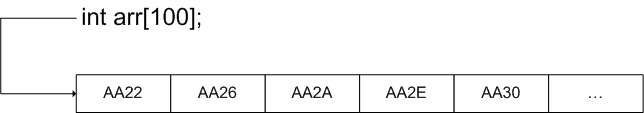

## Массивы

Пусть нам необходимо работать с большим количеством однотипных данных. Например, у нас есть тысяча измерений координаты маятника с каким-то 
шагом по времени. Создавать 1000 переменных для хранения всех значений очень... обременительно. Вместо этого множество однотипных данных можно объединить под одним именем и 
обращаться к каждому конкретному элементу по его порядковому номеру.

Массив в си определяется следующим образом
<тип> <имя массива>[<размер>];

Например, 

int a[100];

Мы получим массив с именем a, который содержит сто элементов типа int. Как и в случае с переменными, массив содержит мусор.

Для получения доступа до первого элемента, в квадратных скобках пишем его номер (индекс). Например

Первый элемент имеет порядковый номер 0. Важно понимать, почему. 
В дальнейшем будем представлять память компьютера в виде ленты. Имя массива - это указатель на адрес памяти, где располагаются элементы массива.

Индекс массива указывает, на сколько байт необходимо сместиться  относительно начала массива, чтобы получить доступ до нужно элемента.
Например, если массив A имеет тип int, то A[10] означает, что мы сместились на 10*sizeof(int) байт относительно начала.
Первый элемент находится в самом начале и у него смещение 0*sizeof(int).

В си массив не хранит своего размера и не проверяет индекс массива на корректность. Это значит, что можно выйти за пределы массива и обратиться к памяти, 
находящейся дальше последнего элемента массива (или ближе).

## Начальная инициализация массива.

Напишем простую программу. Создадим массив, после чего найдём его максимальный элемент.

Разберём пример. Сначала мы создаём массив и инициализируем его при создании. После этого присваиваем максимальному найденному элементу значение первого элемента массива.

После чего проходим по массиву. Так как мы уже просмотрели первый элемент (у него индекс 1), то нет смысла снова его просматривать.

Тот же пример, только теперь пользователь вводит значения

В том случае, если при инициализации указано меньше значений, чем размер массива,  остальные элементы заполняются нулями.

Если необходимо заполнить весь массив нулями, тогда пишем

Можно не задавать размер массива явно, например

массив будет иметь размер 3

## Размер массива

Массив в си должен иметь константный размер. Это значит, что невозможно, например, запросить у пользователя размер, а потом задать этот размер  массиву.

Создание динамических массивов будет рассмотрено дальше, при работе с указателями и памятью

В некоторых случаях можно узнать размер массива с помощью функции sizeof.

Но это вряд ли будет полезным. При передаче массива в качестве аргумента функции будет передаваться указатель, поэтому размер массива будет невозможно узнать.

Статические массивы удобны, когда заранее известно число элементов. Они предоставляют быстрый, но небезопасный доступ до элементов.

## Переполнение массива

Пускай у вас есть такой код

Здесь цикл for задан с ошибкой. В некоторых старых версиях компиляторов этот код зацикливался. Дело в том, что переменная i располагалась при 
компиляции сразу за массивом A. При выходе за границы массива счётчик переводился в 1.
Массивы небезопасны, так как неправильная работа с индексом может приводить к доступу к произвольному участку памяти (Теоретически. Современные компиляторы сами заботятся о том, чтобы вы не копались в чужой памяти).

Если вы работаете с массивами, то необходимо следить за тем, чтобы счётчик не превышал размер массива и не был отрицательным. Для этого, как минимум,

## Примеры

Теперь несколько типичных примеров работы с массивами

1. Переворачиваем массив.

Здесь незнакомая для вас конструкция

макрос. Во всём коде препроцессор автоматически заменит все вхождения SIZE на 10u.

2. Удаление элемента, выбранного пользователем.

Удаление элемента в данном случае, конечно, не происходит. Массив остаётся того же размера, что и раньше. Мы просто затираем удаляемый элемент следующим за ним 
и выводим SIZE-1 элементов.

3. Пользователь вводит значения в массив. После этого вывести все разные значения, которые он ввёл.

Пусть пользователь вводит конечное число элементов, допустим 10. Тогда заранее известно, что всего различных значений будет не более 10. Каждый раз, когда пользователь вводит число будем проходить по массиву и проверять, было ли такое число введено.

4. Пользователь вводит число - количество измерений (от 2 до 10). После этого вводит все измерения. Программа выдаёт среднее значение, дисперсию, погрешность.

5. Сортировка массива пузырьком

6. Перемешаем массив. Воспользуемся для этого алгоритмом Fisher-Yates:
Для i от N-1 до 1 выбираем случайное число j в пределах от 0 до i и меняем местами i-й и j-й элементы.

