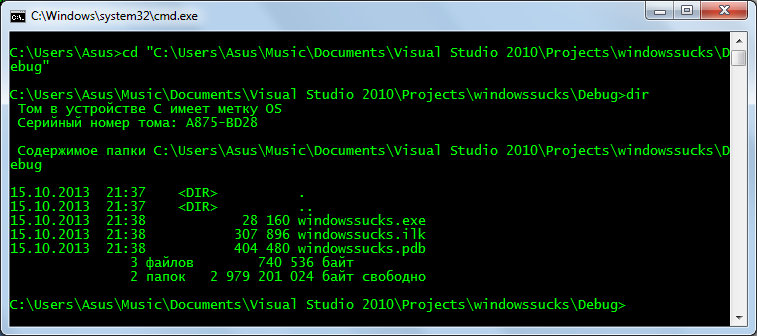

## Параметры командной строки

Си - компилируемый язык. После сборки программа представляет собой исполняемый файл (мы не рассматриваем создание динамических библиотек, 
драйверов и т.д.). Наши программы очень простые и не содержат библиотек времени выполнения (Runtime libraries), поэтому могут быть перенесены на компьютер с такой же 
операционной системой (и подобной архитектурой) и там запущены.

Программа во время запуска может принимать параметры. Они являются аргументами функции main.
Общий вид функции main следующий

Первым аргументом argc является число переданных функции параметров. Второй аргумент – массив строк – собственно сами параметры. Так как параметры у функции могут
быть любыми, то они передаются как строки, и уже сама программа должна их разбирать и приводить к нужному типу.

Первым аргументом (argv[0]) всегда является имя программы. При этом имя выводится в зависимости от того, откуда была запущена программа.

Теперь научимся немного работать с командной строкой. Это понадобится для того, чтобы передавать аргументы нашей программе.
Сочетание клавиш Win+R вызывает окно "Выполнить". Наберите в нём cmd и вы откроете командную строку. Также можно найти cmd.exe поиском в меню Пуск. 
В юникс-подобных операционных системах можно вызвать программу "терминал".

Мы не будем изучать сколько-нибудь много команд. Только те, которые понадобятся в работе.

Для перехода по нужному пишется cd адрес. Например, нужно перейти на windows в папку C:\Windows\System32

cd C:\Windows\System32

В линуксе если нужно перейти в папку /var/mysql

cd /var/mysql

Если путь содержит пробелы, то он пишется в двойных кавычках

cd "D:\Docuents and Settings\Prolog"

Терминал имеет следующие полезные особенности: если нажать стрелку вверх, по появится предыдущая выполненная команда. Если нажать tab, то терминал 
попытается дополнить строку до известной ему команды, или дополнить путь, перебирая все папки и файлы в текущей папке.

Наберите cd C:\
нажимайте tab и смотрите, что происходит.

Ещё одна важная команда dir на windows и ls на linux, выводит на консоль содержимое текущей папки (той папки, в которой вы находитесь в данный момент)

Ваша программа вернула своё полное имя. Перейдите в папку, где располагается ваша программа и посмотрите её содержимое

Теперь, после того, как мы перешли в нашу папку, можно выполнить нашу программу. Для этого наберите её имя.

Заметьте - имя изменилось. Так как программа вызывается из своей папки, то выводится относительно имя. Теперь изменим программу и сделаем так, чтобы она выводила все 
аргументы. которые ей переданы.

Соберите проект. Перед сборкой убедитесь, что  программа закрыта. Теперь вызовите программу, передав ей разные аргументы. Для этого напишите имя программы и через пробел аргументы

Давайте теперь напишем программу, которая получает два аргумента числа и выводит их сумму

Соберём и вызовем

Таким образом работает большинство программ. Кликая на ярлык, вы вызываете программу, на которую он ссылается. Большинство программ также принимают различные аргументы. Например, 
можно вызвать браузер firefox из командной строки и передать аргументы

firefox.exe "www.mozilla.org" "learnc.info" и он сразу же откроет в двух вкладках сайты по указанным адресам.

Многие стандартные команды также имеют параметры. В windows принято, что они начинаются с прямого слеша, в юниксе с минуса или двух минусов. Например

dir /AD 

выводит только папки, а в терминале linux

ls -l
выводит все файлы и папки с указанием атрибутов

Для просмотра дополнительных команд windows наберите в командной строке help или смотрите руководство (его легко найти в интернете). Для линукса команд и их опций гораздо больше, а некоторые из них являются самостоятельными языками программирования, так что стоит выучить хотя бы минимальный набор и их опции.

