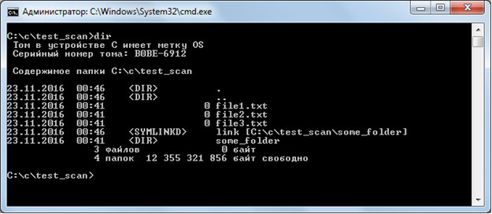

## Чтение файлов в директории

В стандарте си отсутствует реализация работы с папками – ни создания, ни чтения директории, ничего. Для работы с папками в кроссплатформенной библиотеке libuv есть набор методов. Но сначала рассмотрим особенности файловой системы.
Библиотека libuv выделяет следующие типы файлов, описанные с помощью перечисляемого типа uv_dirent_type_t:

Для чтения содержимого папки сначала производим запрос uv_fs_scandir

Все аргументы функции нам уже знакомы. Результатом выполнения (напомню, результат – это поле result запроса, который 
будет передан колбэку) будет число считанных объектов в папке. Для прохода по всем элементам используется функция 
uv_fs_scandir_next

где req – это полученный колбэком запрос, а второй аргумент – это структура типа uv_dirent_t. Эта структура после каждой
 итерации будет иметь интересующие нас значения – поле name с именем объекта, и поле type типа uv_dirent_type_t, 
 которое определяет тип объекта (о нём говорилось в самом начале).

Для тестирования создадим папку с тремя файлами, папкой и ссылкой.

Код программы для чтения списка файлов в каталоге

Для создания новой директории есть две функции

создаёт новый каталог. Стоит заметить, что аргумент mode  не используется в ОС Windows. Также можно использовать функцию

которая создаёт каталог с уникальным именем. При этом аргумент tpl – это шаблон имени, в котором последние 6 символов буду заменены на случайный набор символов.

Пример создания папки. Далее все директивы пропущены, чтобы уменьшить размер программы

При создании папки с уникальным именем её имя будет в поле path запроса

Для удаления папки в кроссплатформенной библиотеке libuv используется функция

Важно, что директория должна быть пустой.

Пример программы для удаления пустой директории

