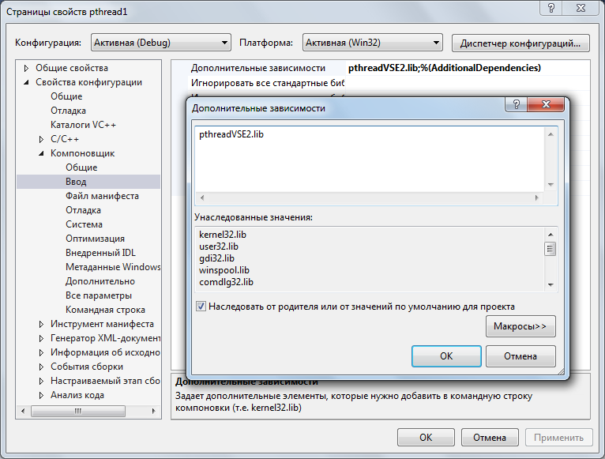

## Установка библиотеки pthread.h в среде Visual Studio

На примере Visual Studio 2012 Express Edition, Windows 7. Воспользуемся ресурсом 
ftp://sourceware.org/pub/pthreads-win32/dll-latest

Теперь появится возможность добавлять библиотеку pthread.h: Visual Studio увидит её, будет подсвечивать синтаксис и выводить подсказки.

Каждый новый проект потребует этого шага. Для проверки напишем простое приложение

Вместо pthreadVSE2 можно качать и устанавливать файлы pthreadVC2. Но тогда и в дополнительных зависимостях придётся писать pthreadVC2.lib.

