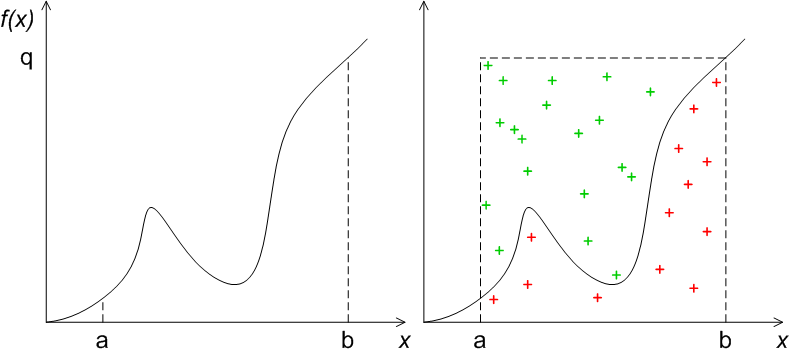

## Псевдослучайные числа

Генерация псевдослучайных чисел – это сложная математическая задача. Данная статья не 
ставит перед собой задачи охватить эту тему. Далее понятие «случайное число» будет означать псевдослучайное, если это 
не оговорено особо.

С примерами использования случайных чисел вы сталкиваетесь повсюду. Псевдослучайные числа используются в дизайне и графике, для генерации уровней в компьютерных играх и симулирования ИИ. Наборы случайных чисел используются в математических алгоритмах (см. Методы Монте-Карло).

Очевидно, что задача генерации случайных чисел на классическом процессоре не может быть решена, так как работа компьютера детерминирована по определению. Тем не менее, можно сгенерировать очень длинные наборы чисел такие, что их распределение будет иметь те же свойства, что и наборы истинно случайных чисел.

Важно, что для решения той или иной задачи необходимо правильно выбирать генератор, или как минимум знать его свойства. Например, при моделировании физического процесса можно получить совершенно  разные и часто неверные результаты, в зависимости от выбора генератора случайных чисел.

Посмотрим стандартный генератор.

Для начала необходимо инициализировать генератор случайных чисел (ГСЧ, или RNG - random number generator), задать зерно – seed, на основе которого в дальнейшем будет происходить генерация. Важно, что для одного и того же начального значения генератор будет возвращать одни и те же числа.

Присваиваем переменной r случайное значение

Значение будет лежать в диапазоне от 0 до RAND_MAX.

Для того, чтобы при следующем запуске получить новый набор чисел, нужно инициализировать генератор каждый раз разными значениями. Например, можно использовать системной время:

Или

Функция getpid библиотеки process.h возвращает идентификатор процесса (можно также использовать getpid, не POSIX версию функции).

Очень важно сразу напомнить или познакомить с центральной предельной теоремой. Неформальное определение – распределение суммы слабо зависимых случайных величин стремится к нормальному. Пальцеобразное объяснение: если сложить несколько случайных величин, независимо от их распределения, то распределение суммы будет нормальным. Часто можно увидеть такой код

Таким образом автор пытается сделать случайное число «более» случайным, но получает менее случайное число.

Во-первых, получим случайное число от нуля до единицы:

Для получения числа в отрезке от нуля до N умножим N на случайное число от нуля до единицы. Для получения случайного числа от M До N, сдвинем полученное число на M.

Для получения целого числа, будем брать остаток от деления на длину интервала. Но остаток от деления будет возвращать число на единицу меньше, чем наш интервал, поэтому увеличим его на единицу:

Пример использования случайных чисел для вычисления интеграла. Пусть у нас есть некоторая гладкая функция от одной переменной. Ограничим её квадратом от a до b, и от 0 до некоторой точки, которая заведомо больше нашей функции.

Будем случайным образом кидать точки на нашем квадрате. Если они лежат выше функции (на рисунке изображены зелёными крестиками), то отнесём их к первой группе A, если ниже функции (на рисунке красные), то отнесём их ко второй группе B. Положение точек случайное и распределено равномерно (т.к. стандартный генератор даёт равномерное распределение. Этот простой пример, кстати, уже показывает, насколько важно знать свойства ГСЧ). Тогда отношение красных точек к общему числу точек будет равно отношению площади под графиком к общей площади. А общая площадь – это квадрат (b-a) на q.

Применим наши выкладки – найдём интеграл функции x^2 на отрезке от 0 до двух двумя способами.

Поиграйте со значением ROUNDS, измените его и посмотрите, как меняется точность вычислений.

Для генерации настоящих случайных чисел используют генераторы, основанные на каких-то случайных физических процессах. Например, на тепловых шумах, на подсчёте числа делений радиоактивного вещества, на атмосферных шумах и т.п. Недостаток таких генераторов – низкая скорость работы (количество сгенерированных чисел в секунду) ; конечно, такие генераторы обычно являются отдельным устройством.

Если есть необходимость в большом наборе истинно случайных чисел, можно воспользоваться таблицами случайных чисел, 
например на сайте RANDOM.ORG

