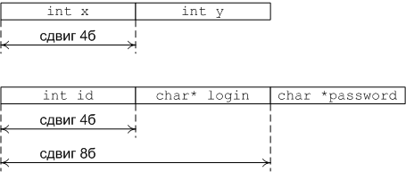

## Введение

Мир вокруг можно моделировать различными способами. Самым естественным из них является представление о нём, как о наборе объектов. У каждого объекта есть свои свойства. 
Например, для человека это возраст, пол, рост, вес и т.д. Для велосипеда – тип, размер колёс, вес, материал, изготовитель и пр. Для товара в магазине – идентификационный номер, 
название, группа, вес, цена, скидка и т.д.

У классов объектов набор этих свойств одинаковый: все собаки могут быть описаны, с той или иной точностью, одинаковым набором свойств, но значения этих свойств будут разные.

Все самолёты обладают  набором общих свойств в пределах одного класса. Если же нам надо более точное описание, то можно выделить подклассы: самолёт амфибии, боевые 
истребители, пассажирские лайнеры – и в пределах уже этих классов описывать объекты.
Например, нам необходимо хранить информацию о сотрудниках компании. Каждый сотрудник, в общем, обладает большим количеством разных свойств. 
Мы выберем только те, которые нас интересуют для решения прикладной задачи: пол, имя, фамилия, возраст, идентификационный номер. Для работы с таким 
объектом нам необходима конструкция, которая бы могла агрегировать различные типы данных под одним именем. Для этих целей в си используются структуры.

## Объявление структуры

Синтаксис объявления структуры

Например

Полями структуры могут быть любые объявленные типы, кроме самой структуры этого же типа, но можно хранить указатель на структуру этого типа:

Нельзя, нужно

В том случае, если несколько полей имеют один тип, то их можно перечислить через запятую:

После того, как мы объявили структуру, можно создавать переменную такого типа с использованием служебного слова struct. Доступ до полей структуры осуществляется с 
помощью операции точка:

Структура, объявленная в глобальном контексте, видна всем. Структура также может быть объявлена внутри функции:

Можно упростить пример: синтаксис языка позволяет создавать экземпляры структуры сразу же после определения:

Структура также может быть анонимной. Тогда мы не сможем использовать имя структуры в дальнейшем.

В этом примере мы создали переменную A. Она является структурой с двумя полями.

## Начальная инициализация структур

Структуру можно инициализировать во время создания как массив. Поля в этом случае будут присваиваться по порядку.

Замечание: таким образом можно только иницализировать структуру. Присваивать значение всей структуре таким образом нельзя.

Современный стандарт си позволяет инициализировать поля структуры по имени. Для этого используется следующий синтакис:

## Определение нового типа

Когда мы определяем новую структуру с помощью служебного слова struct, в пространстве имён структур (оно не имеет ничего общего с пространствами имён С++) создаётся новый  идентификатор. Для доступа к нему необходимо использовать служебное слово struct.
Можно определить новый тип с помощью служебного слова typedef. Тогда будет создан псевдоним для нашей структуры, видимый в глобальном контексте.

Теперь при работе с типом Point нет необходимости каждый раз писать слово struct. Два объявления можно объединить в одно

Замечание. Если мы создаём новый тип-структуру, полем которого является указатель на этот же тип, то его необходимо объявлять явно с использованием служебного слова struct

## Указатели на структуру

Указатель на структуру создаётся как обычно. Отличие заключается в том, что можно обращаться к полям структуры через указатель с помощью операции "стрелка" (минус + больше). 
Пример – пользователь вводит число – размер массива пользователей. Поле этого вводит для каждого из них логин и пароль. Третье поле - идентификатор – задаётся 
автоматически. После этого все пользователи выводятся на экран.

Обратите внимание на удаление массива структур: при удалении экземпляра структуры он не удаляет своих полей самостоятельно, поэтому необходимо сначала 
удалять поля, после этого удалять сам массив.
При вызове функции jsonUser мы передаём указатель на экземпляр структуры, поэтому внутри функции доступ до полей осуществляется с помощью оператора стрелка.

## Устройство структуры в памяти

Поля структуры расположены в памяти друг за другом. Тип поля определяет сдвиг относительно предыдущего поля. Имя поля - это сдвиг относительно адреса экземпляра.
На самом деле размер структуры не всегда равен сумме размеров её полей: это связано с тем, что компилятор оптимизирует расположение структуры в памяти и может поля 
небольшого размера подгонять до чётных адресов.

Первая структура должна иметь размер 6 байт, вторая 8 байт, третья 7 байт, однако на 32-разрядной машине компилятор VC сделает их все три равными 8 байт.
Стандарт гарантирует, что поля расположены друг за другом, но не гарантирует, что непрерывно.

Есть возможность изменить упаковку структур в памяти. Можно явно указать компилятору каким образом производить упаковку полей структуры, объединений или полей класса. Каким
образом это делать, зависит от компилятора. Один из самых распространённых способов прагма pack()

Использование #pragma pack не приветствуется: логика работы программы не должна зависить от внутреннего представления структуры (если, конечно, вы не занимаетесь
системным программированием или ломаете чужие программы и сети).

## Приведение типов

Стандартом поведение при приведении одной структуры к другой не определено. Это значит, что даже если структуры имеют одинаковые поля, то нельзя явно 
кастовать одну структуру до другой.

Этот пример работает, но это хак, которого необходимо избегать. Правильно писать так

Привести массив к структуре (или любому другому типу) по стандарту также невозможно (хотя в различных компиляторах есть для этого инструменты).
Но в си возможно всё.

Но запомните, что в данном случае поведение не определено.

## Вложенные структуры

Структура сама может являться полем структуры. Пример: структура Model – модель автомобиля, имеет название, номер, год выпуска и поле Make, которое в 
свою очередь хранит номер марки и её название.

Вложенные структуры инициализируются как многомерные массивы. В предыдущем примере можно произвести начальную инициализацию следующим образом:

P.S. подобным образом инициализировать строки не стоит, здесь так сделано только для того, чтобы упростить код.

## Указатели на поля структуры и на вложенные структуры

Указатели на поля структуры определяются также, как и обычные указатели. Указатели на вложенные структуры возможны только тогда,
когда структура определена. Немного переделаем предыдущий пример: "деанонимизируем" вложенную безымянную структуру и
возьмём указатели на поля структуры Model:

Как уже говорилось ранее, в си, даже если у двух структур совпадают поля, но структуры имеют разные имена, то их нельзя приводить к одному типу. Поэтому
приходится избавляться от анонимных вложенных структур, если на них нужно взять указатель. Можно попытаться взять указатель типа char*
на поле структуры, но нет гарантии, что поля будут расположены непрерывно.

## Примеры

1. Стек, реализованный с помощью структуры "Узел", которая хранит значение (в нашем примере типа int) и указатель на следующий узел. Это неэффективная реализация, которая
требует удаления и выделения памяти под узел при каждом вызове операции push и pop.

2. Реализуем структуру - массив, и некоторые операции для работы с массивами. Тип массива зададим макроподстановкой.

3. Структура Линия, состоит из двух структур точек. Для краткости реализуем только пару операций

Обратите внимание на операции создания и копирования линии. Обязательно нужно копировать содержимое, иначе при изменении или удалении объектов, которые мы получили в качестве аргументов, наша линия также изменится.
Если структура содержит другие структуры в качестве полей, то необходимо проводить копирование содержимого всех полей. Глубокое копирование позволяет избежать неявных зависимостей.

4. Структура комплексное число и функции для работы с ней.

5. Биномиальная куча и сортировка на куче

