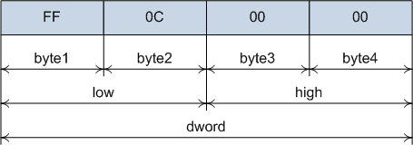

## Объединения

Объединения в си похожи на структуры, с той разницей, что все поля начинаются с одного адреса. 
Это значит, что размер объединения равен размеру самого большого его поля. Так как все поля начинаются с одного адреса, то 
их значения перекрываются. Рассмотрим пример:

Здесь было создано объединение, которое содержит три поля – одно поле целого типа (4 байта), два поля типа short int (2 байта каждое) и 
4 поля по одному байту. После того, как значение было присвоено полю dword, оно также стало доступно и остальным полям.

Напоминаю, что на x86 байты располагаются справа налево. Все поля объединения "обладают" одинаковыми данными, но каждое поле имеет доступ 
только до своей части.
Вот ещё один пример: рассмотрим представление числа с плавающей точкой:

Обратите внимание, что объединение можно инициализировать, как и структуру. При этом значение будет приводиться к типу, 
который имеет самое первое поле. Сравните результаты работы

## Битовые поля

Битовые поля в си объявляются с помощью структур. Они позволяют получать доступ до отдельных битов или групп битов. 
Доступ до отдельных битов можно осуществлять и с помощью битовых операций, но использование битовых полей часто упрощает 
понимание программы.
Синтаксис объявления битового поля

В этом примере каждое поле структуры обозначено как битовое поле, длина каждого поля равна единице. Обращаться к каждому полю можно 
также, как и к полю обычной структуры.
Битовые поля имеют тип unsigned int, так как имеют длину один бит. Если длина поля больше одного бита, то поле может 
иметь и знаковый целый тип.

Размер структуры, содержащей битовые поля, всегда кратен 8. То есть, если одно поле содержит 5 бит, а второе 4, то второе поле начинается с восьмого бита и три бита остаются неиспользованными.
Неименованное поле может иметь нулевой размер. В этом случае следующее за ним поле смещается так, чтобы добрать до 8 бит.
Если же адрес поля уже кратен 8 битам, то нулевое поле не добавит сдвига.
Кроме того, если имеются обычные поля и битовые поля, то первое битовое поле будет сдвинуто так, чтобы добрать до 8 бит.

В этих примерах видно, что структура добирает даже не до 8 бит, а больше - до адреса, кратного 4 байтам.
Работать подобным образом, инициализируя каждое поле по отдельности, неудобно. Поэтому структуры с битовыми полями делают полем 
объединения, например:

Те же самые действия можно было сделать и с помощью обычного сдвига

Рассмотрим ещё один пример – знакопостоянный сдвиг вправо. Сдвиг вправо (>>) выталкивает самый левый бит и справа записывает ноль. Из-за этого операцию сдвига вправо нельзя применить, например, для чисел со знаком, так как будет потерян бит знака.
Исправим ситуацию, сделаем знакопостоянный сдвиг: будем проверять последний бит числа (напомню, что мы работаем с архитектурой x86 и биты расположены «задом наперёд»)

Здесь я специально использовал тип int32_t (библиотека stdint.h), чтобы гарантировать размер переменных в 32 бита. Теперь можно вызвать функцию и посмотреть результат.

Вывод

