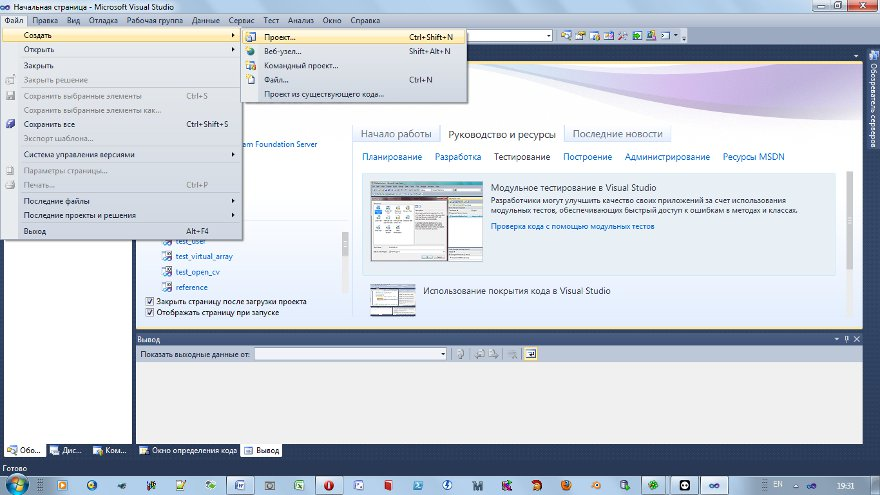
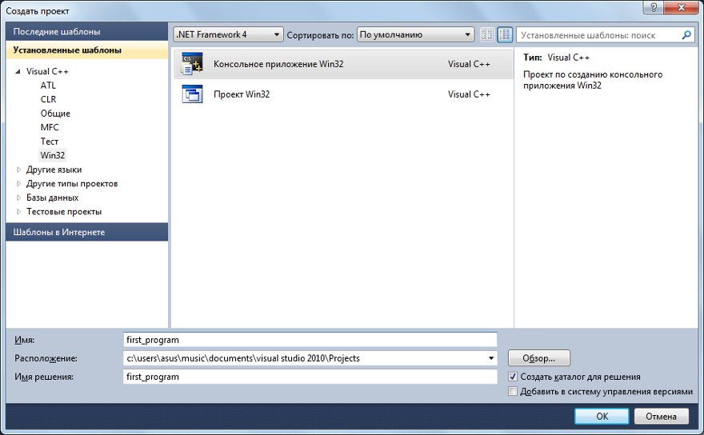
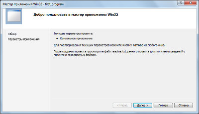
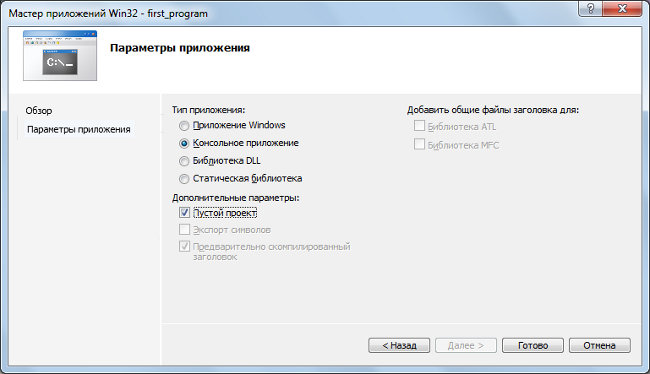
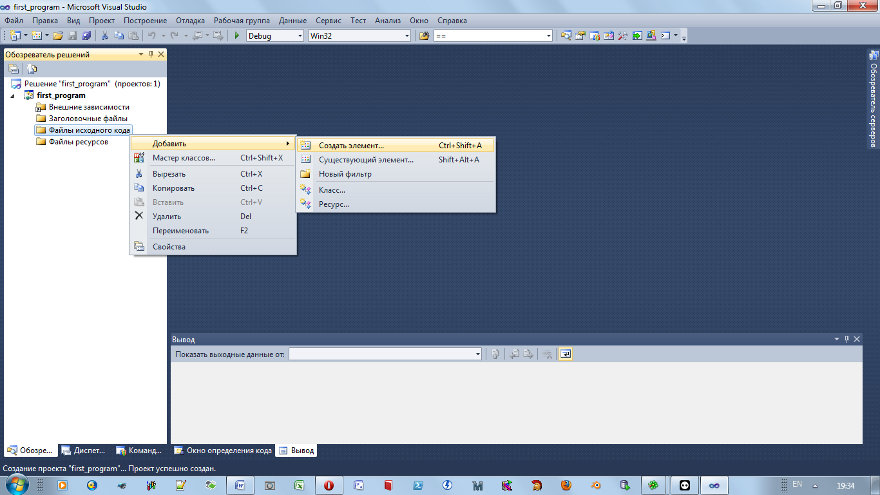
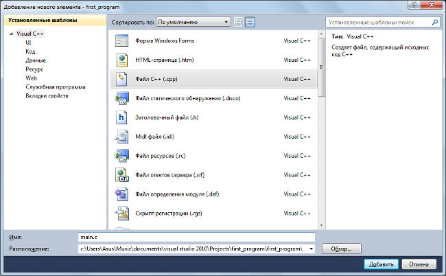
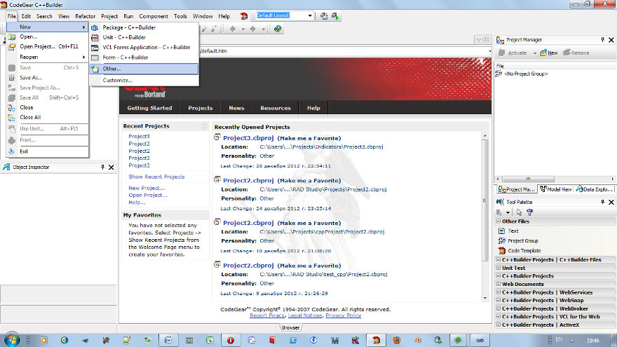
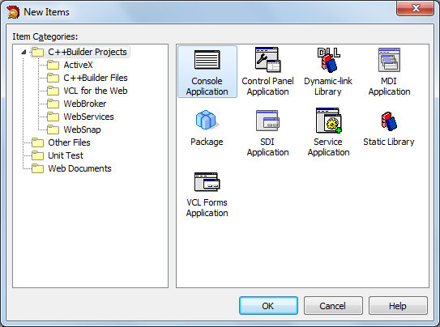
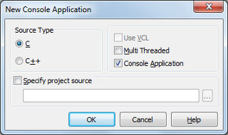
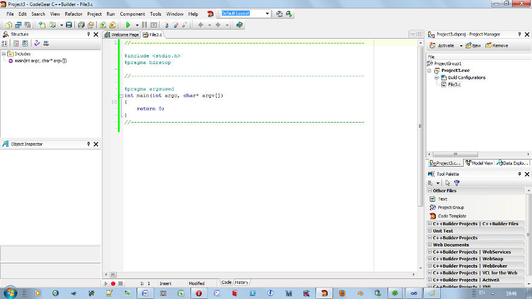

# Пишем первую программу (Windows)

Для начала, необходимо установить программное обеспечение. В принципе не важно, каким ПО вы будете пользоваться, также как не важна и операционная система. Но в течение всего курса я буду приводить примеры на MS Visula Studio 2012 Express Edition. Visual Studio 2012 Express Edition бесплатный и его за глаза хватит для изучения всего курса. Кроме того, как показала практика, он гораздо строже относится к коду и даёт более полноценное описание ошибок и предупреждений.
При изучении языка можно использовать Borland (он же CodeGEAR, он же Embarcadero и т.д.), Dev Cpp, MinGW, или gcc, или что вы ещё захотите.

## Пример для MS Visual Studio

1. Открываем IDE, заходим Файл | Создать проект...



2. Выбираем консольное приложение и даём ему имя. В данном случае first_program



3. Далее...



4. Ставим галочку "Пустой проект".



5. После чего получаем пустую структуру проекта. Добавим новый элемент: правый клик мыши по папке "Файлы исходного кода" | Добавить | Создать элемент...



Добавляем новый cpp файл, но сохраняем его с расширением .c



Я назвал файл main.c
Всё, готово, можно писать программу. Пропустите шаги для других платформ.

## Borland

У меня установлен только Code Gear C++Builder 2007, но в остальных (и предыдущих) релизах всё делается также.

1. Создадим новый проект File | New | Other...



2. Добавляем консольное приложение



3. Выбираем язык си



4. Получаем готовый проект. Его необходимо сохранить с тем именем, которое захотите. До тех пор сам проект и все файлы будут иметь имена по умолчанию. Вы можете удалить то, что Borland по умолчанию прописал в тексте программы.



## Пример для cc/gcc для терминала

Откройте ваш любимый текстовый редактор и скопируйте туда код программы.

```
#include <stdio.h>

int main(int argc, char* argv[]) {
	printf("Hello, World!");
	scanf("1");
	return 0;
}
```

Если вы сохранили программу в файле с именем hello.c, то наберите в терминале команду

cc hello.c -o hello

либо

gcc hello -o hello

При этом, очевидно, вы должны находиться в папке с программой. gcc создаст исполняемый файл с именем hello. Запустите его, и он выведет Hello, World!


./hello


Иногда могут возникнуть проблемы с правами доступа. Проверьте, что у вас исполняемый файл, иначе дайте себе привелегии на запуск.


chmod 760 hello

Если у вас несколько файлов, то необходимо будет перечислить имена всех си файлов по порядку. Например, если у вас есть ещё два файла simple.h и simple.c, то нужно прописать


cc hello.c simple.c -o hello

## Код программы

Принято в первой программе выводить Hello, World! на экран.

```
#include <stdio.h>
#include <conio.h>

int main(int argc, char* argv[]) {
	printf("Hello, World!");
	_getch();
	return 0;
}
```

Запустите программу ( Run | Run  или F9 для борланда,  Построение | Построить решение или F5 для MS)
Программа выведет Hello, World! и будет ждать, когда вы нажмёте на любую клавишу.

Рассмотрим код подробнее. 
Первые две строки

```
#include <stdio.h>
#include <conio.h>
```

директивы компилятору на подключение стандартных библиотек stdio (Standard Input Output - стандартная библиотека ввода вывода) и conio (Console Input Output - стандартная библиотека консоли  вывода вывода).
Расширение .h указывает, что это заголовочные файлы (header files).

Компилятор копирует код библиотек conio и stdio, и даёт возможность использовать функции, описанные в этих библиотеках.

```
int main(int argc, char* argv[])
```

Это функция main. Она отличается от остальных функций, которые вы можете определить тем, что является точкой входа - с неё начинается выполнение программы.

Функция main имеет два параметра - число параметров argc и массив переданных параметров argv. Эти аргументы необязательные, поэтому можно их не писать. Об их использовании поговорим позже.

```
#include <stdio.h>
#include <conio.h>

int main() {
	printf("Hello, World!");
	_getch();
	return 0;
}
```

```
#include <stdio.h>
#include <conio.h>

void main() {
	printf("Hello, World!");
	_getch();
}
```

```
printf("Hello, World!");
```

```
_getch()
```

Давайте сделаем что-нибудь посложнее, чтобы научиться добавлять новые файлы в программу. Сейчас для вас важно научиться добавлять новые файлы, если часть кода останется непонятной, это не беда.

1. Создайте новый заголовочный файл в папке "Заголовочные файлы", назовите его simple.h
2. Создайте новый файл simple.c в папке "Файлы исходного кода".
3. Добавьте в simple.h

```
#ifndef _SIMPLE_H_
#define _SIMPLE_H_

#include <stdio.h>
#include <conio.h>

void doSomething();

#endif
```

Здесь мы объявили новую функцию doSomething. У неё отсутствует тело, оно будет описано в файле simple.c. Здесь же мы подключаем и библиотеки stdio и conio
Добавьте в simple .c

```
#include "simple.h"

void doSomething() {
	printf("It works!");
	_getch();
}
```

Мы включаем в файл simple.c заголовочный файл. Он пишется в двойных кавычках, потому что это не файл из стандартной библиотеки. Файлы стандартной библиотеки обычно располагаются в папке include самой IDE. Если поместить туда наши файлы, то их тоже можно будет объявлять в угловых скобках. В двойных кавычках можно также прописывать абсолютные пути к файлам.
Так как мы уже включили библиотеки conio и stdio в .h файле, то они "видны" и в .c файле.
Далее, в main.c

```
#include "simple.h"

int main(int argc, char* argv[]) {
	doSomething();
	return 0;
}
```

Мы подключаем только заголовочный файл. Содержимое simple.c будет добавлено автоматически. Собираем проект (F5 или F9, или что там у вас за среда...) Если у вас всё заработало то отлично, вы научились добавлять новые файлы в проект.

