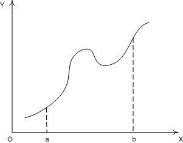
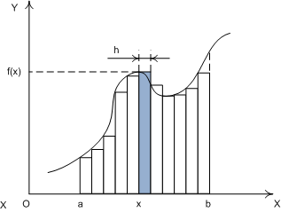
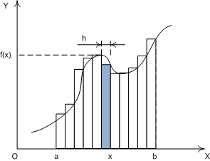
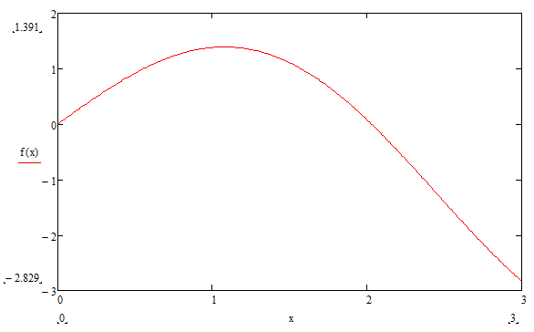

# Циклы

## Введение. Циклы с предусловием.

При решении практических задач постоянно возникает необходимость в повторении действия заданное количество раз, или до достижения какого-либо условия. Например, вывести список всех пользователей, замостить плоскость текстурой, провести вычисления над каждым элементом массива данных и т.п.
В си для этих целей используются три вида циклов: с предусловием, постусловием и цикл for со счётчиком (хотя, это условное название, потому что счётчика может и не быть).

Любой цикл состоит из тела и проверки условия, при котором этот цикл должен быть прекращён. Тело цикла - это тот набор инструкций, который необходимо повторять. Каждое повторение цикла называют итерацией.

Рассмотрим цикл с предусловием.

```
int i = 0;

while (i < 10) {
	printf("%d\n", i);
	i++;
}
```

Этот цикл выполняется до тех пор, пока истинно условие, заданное после ключевого слова while.
Тело цикла - это две строки, одна выводит число, вторая изменяет его.
Очевидно, что этот цикл будет выполнен 10 раз и выведет на экран
0
1
2
3
и так далее до 9.

Очень важно, чтобы условие выхода из цикла когда-нибудь выполнилось, иначе произойдёт зацикливание, и программа не завершится.
К примеру

```
int i = 0;

while (i < 10) {
	printf("%d\n", i);
}
```

В этом цикле не изменяется переменная i, которая служит для определения условия останова, поэтому цикл не завершится.

```
int i = 0;

while (i > 0) {
	printf("%d\n", i);
	i++;
}
```

В этой программе цикл, конечно, завершится, но из-за неправильного действия он будет выполнен гораздо больше 10 раз. Так как си не следит за переполнением переменной, нужно будет ждать, пока переменная переполнится и станет меньше нуля.

```
int i;

while (i < 10) {
	printf("%d\n", i);
	i++;
}
```

У этого примера неопределённое поведение. Так как переменная i заранее не инициализирована, то она хранит мусор, заранее неизвестное значение. При различном содержимом переменной i будет меняться поведение.

Если тело цикла while содержит один оператор, то фигурные скобки можно опустить.

```
int i = 0;

while (i < 10)
	printf("%d\n", i++);
```

Здесь мы инкрементируем переменную i при вызове функции printf.
Следует избегать такого стиля кодирования. Отсутствие фигурных скобок, особенно в начале обучения, может приводить к ошибкам. Кроме того, код читается хуже, да и лишние скобки не сильно раздувают листинги.

## Циклы с постусловием.

Цикл с постусловием отличается от цикла while тем, что условие в нём проверяется после выполнения цикла, то есть этот цикл будет повторён как минимум один раз (в отличие от цикла while, который может вообще не выполняться). Синтаксис цикла

```
do {
	тело цикла
} while(условие);
```

Предыдущий пример с использованием цикла do будет выглядеть как

```
int i = 0;

do {
	printf("%d\n", i);
	i++;
} while(i < 10);
```

Давайте рассмотрим пример использования цикла с постусловием и предусловием. Пусть нам необходимо проинтегрировать функцию.



Интеграл - это сумма бесконечно малых. Мы можем представить интеграл как сумму, а бесконечно малые значения просто заменить маленькими значениями.

Из формулы видно, что мы на самом деле разбили площадь под графиком на множество прямоугольников, где высота прямоугольника - это значение функции в точке, а ширина - это наш шаг. Сложив площади всех прямоугольников, мы тем самым получим значение интеграла с некоторой погрешностью.



Пусть искомой функцией будет 

      
       
       x
       2
       
      
.
Нам понадобятся следующие переменные. Во-первых, аккумулятор sum для хранения интеграла. Во-вторых, левая и правая границы a и b, в третьих - шаг h. Также нам понадобится текущее значение аргумента функции x.

Для нахождения интеграла необходимо пройти от a до b с некоторым шагом h, и прибавлять к сумме площадь прямоугольника со сторонами f(x) и h.

```
#include<conio.h>
#include<stdio.h>

int main() {
	double sum = 0.0;
	double a = 0.0;
	double b = 1.0;
	double h = 0.01;
	double x = a;
	
	while (x < b) {
		sum += x*x * h;
		x += h;
	}
	
	printf("%.3f", sum);
	getch();
}
```

Программа выводит 0.328.

Решение

Если посмотреть на график, то видно, что каждый раз мы находим значение функции в левой точке. Поэтому такой метод численного интегрирования называют методом левых прямоугольников. Аналогично, можно взять правое значение. Тогда это будет метод правых прямоугольников.

```
while (x < b) {
	x += h;
	sum += x*x * h;
}
```



Сумма в этом случае будет равна 0.338. Метод левых и правых прямоугольников не очень точен. Мы фактически аппроксимировали (приблизили) гладкий график монотонно возрастающей функции гистограммой.
Если немного подумать, то аппроксимацию можно проводить не только суммируя прямоугольники, но и суммируя трапеции.


Приближение с помощью трапеций на самом деле является кусочной аппроксимацией кривыми первого порядка (ax+b). Мы соединяем точки на графике с помощью отрезков. Можно усложнить, 
соединяя точки не отрезками, а кусками параболы, тогда это будет метод Симпсона. Если ещё усложнить, то придём к сплайн интерполяции, но это уже другой, очень долгий разговор.

Вернёмся к нашим баранам. Рассмотрим 4 цикла.

```
int i = 0;
while ( i++ < 3 ) {
	printf("%d ", i);
}
```

```
int i = 0;
while ( ++i < 3 ) {
	printf("%d ", i);
}
```

```
int i = 0;
do {
	printf("%d ", i);
} while(i++ < 3);
```

```
int i = 0;
do {
	printf("%d ", i);
} while(++i < 3);
```

Если выполнить эти примеры, то будет видно, что циклы выполняются от двух, до четырёх раз. На это стоит обратить внимание, потому что неверное изменение счётчика цикла часто приводит к ошибкам.

Часто случается, что нам необходимо выйти из цикла, не дожидаясь, пока будет поднят какой-то флаг, или значение переменной изменится. Для этих целей служит оператор break, который заставляет программу выйти из текущего цикла.

Давайте решим простую задачу. Пользователь вводит числа до тех пор, пока не будет введено число 0, после этого выводит самое большое из введённых.
Здесь есть одна загвоздка. Сколько чисел введёт пользователь не известно. Поэтому мы создадим бесконечный цикл, а выходить из него будем с помощью оператора break. Внутри цикла мы будем получать от пользователя данные и выбирать максимальное число.

```
#include<conio.h>
#include<stdio.h>

int main() {
	int num = 0;
	int max = num;
	
	printf("To quit, enter 0\n");
	/*бесконечный цикл*/
	while (1) {
		printf("Please, enter number: ");
		scanf("%d", &num);
		/*условие выхода из цикла*/
		if (num == 0) {
			break;
		}
		if (num > max) {
			max = num;
		}
	}
	
	printf("max number was %d", max);
	getch();
}
```

Напомню, что в си нет специального булевого типа. Вместо него используются числа. Ноль - это ложь, все остальные значения – это истина.
Цикл while(1) будет выполняться бесконечно. Единственной точкой выхода из него является условие

```
if (num == 0)
```

В этом случае мы выходим из цикла с помощью break;
Для начала в качестве максимального задаём 0. Пользователь вводит число, после чего мы проверяем, ноль это или нет. Если это не ноль, то сравниваем его с текущим максимальным.

Бесконечные циклы используются достаточно часто, так как не всегда заранее известны входные данные, либо они могут меняться во время работы программы.

Когда нам необходимо пропустить тело цикла, но при этом продолжить выполнение цикла, используется оператор continue. Простой пример: пользователь вводит десять чисел. Найти сумму всех положительных чисел, которые он ввёл.

```
#include<conio.h>
#include<stdio.h>

int main() {
	int i = 0;
	int positiveCnt = 0;
	float sum = 0.0f;
	float input;

	printf("Enter 10 numbers\n");
	while (i < 10) {
		i++;
		printf("%2d: ", i);
		scanf("%f", &input);

		if (input <= 0.0) {
			continue;
		}

		sum += input;
		positiveCnt++;
	}

	printf("Sum of %d positive numbers = %f", positiveCnt, sum);
	getch();
}
```

Пример кажется несколько притянутым за уши, хотя в общем он отражает смысл оператора continue. В этом примере переменная positiveCnt является счётчиком положительных чисел, sum сумма, а input - временная переменная для ввода чисел.

Вот ещё один пример. Необходимо, чтобы пользователь ввёл целое число больше нуля и меньше 100. Пока необходимое число не будет введено,  программа будет продолжать опрос.

```
do {
	printf("Please, enter number: ");
	scanf("%d", &n);
	if (n < 0 || n>100) {
		printf("bad number, try again\n");
		continue;
	} else {
		break;
	}
} while (1);
```

## Цикл for

Одним из самых используемых является цикл со счётчиком for. Его синтаксис

```
for (<инициализация>; <условие продолжения>; <изменение счётчика>){
	<тело цикла>
}
```

Например, выведем квадраты первых ста чисел.

```
int i;
for (i = 1; i < 101; i++) {
	printf("%d ", i*i);
}
```

Одним из замечательных моментов цикла for является то, что он может работать не только с целыми числами.

```
float num;
for (num = 5.3f; num > 0f; num -= 0.2) {
	printf("%.2f ", num);
}
```

Этот цикл выведет числа от 5.3 до 0.1. 
Цикл for может не иметь некоторых "блоков" кода, например, может отсутствовать инициализация, проверка (тогда цикл становится бесконечным) или изменение счётчика. 
Вот пример с интегралом, реализованный с применением счётчика for

```
#include<conio.h>
#include<stdio.h>

int main() {
	double sum = 0.0;
	double a = 0.0;
	double b = 1.0;
	double h = 0.01;
	double x;
	
	for (x = a; x < b; x += h) {
		sum += x*x * h;
	}
	
	printf("%.3f", sum);
	getch();
}
```

Давайте рассмотрим кусок кода

```
double x ;

for (x = a; x < b; x += h) {
	sum += x*x * h;
}
```

Его можно изменить так

```
double x = a;

for (; x < b; x+=h) {
	sum += x*x*h;
}
```

Более того, используя оператор break, можно убрать условие и написать

```
double x;
for (x = a;; x += h){
	if (x>b){
		break;
	}
	sum += x*x*h;
}
```

или так

```
double x = a;
for (;;){
	if (x > b){
		break;
	}
	sum += x*x*h;
	x += h;
}
```

кроме того, используя оператор ",", можно часть действий перенести

```
double x ;
for (x = a; x < b; x += h, sum += x*x*h) ;
```

ЗАМЕЧАНИЕ: несмотря на то, что так можно делать, пожалуйста, не делайте так! Это ухудшает читаемость кода и приводит к трудноуловимым ошибкам.

Давайте решим какую-нибудь практическую задачу посложнее.
Пусть у нас имеется функция f(x). Найдём максимум её производной на отрезке.
Как найти производную функции численно? Очевидно, по определению). Производная функции в точке - это тангенс угла наклона касательной.


Возьмём точку на кривой с координатами (x; f(x)), сдвинемся на шаг h вперёд, получим точку (x+h, f(x+h)), тогда производная будет

То есть, отношение малого приращения функции к малому приращению аргумента.
Внимательный читатель может задать вопрос, почему мы двигаемся вперёд по функции, а не назад. Ну пойдёмте назад

Возьмём среднее от этих двух значений, получим

В общем-то теперь задача становится тривиальной: идём от точки a до точки b и находим минимальное значение производной, а также точку, в которой производная принимает это значение.
Для решения нам понадобятся, как и в задаче с интегралом, переменные для границ области поиска a и b, текущее значение x и шаг h. 
Кроме того, необходимо максимальное значение maxVal и координата maxX этого максимального значения.
Для работы возьмём функцию 

	
		x
		•
        sin
        &ApplyFunction;
		x

```
#include<conio.h>
#include<math.h>
#include<stdio.h>

int main() {
	double a      = 0;
	double b      = 3.0;
	double h      = 0.001;
	double h2     = h * 2.0;
	double maxVal = a*sin(a);
	double maxX   = a;
	double curVal;
	double x;

	// Проходим по всей области от a до b
	// и ищем максимум первой производной
	// Используем функцию x*sin(x)
	for (x = a; x < b; x += h) {
		curVal = ( (x+h)*sin(x+h)-(x-h)*sin(x-h) )/h2;
		if (curVal > maxVal) {
			maxVal = curVal;
			maxX = x;
		}
	}

	printf("max value = %.3f at %.3f", maxVal, maxX);
	getch();
}
```

На выходе программа выдаёт
max value = 1.391 at 1.077



Численное решение даёт такие же (с точностью до погрешности) результаты, что и наша программа.

## Вложенные циклы

Рассмотрим пример, где циклы вложены друг в друга. Выведем таблицу умножения.

```
#include<conio.h>
#include<math.h>
#include<stdio.h>

int main() {
	int i, j;

	// Для каждого i
	for (i = 1; i < 11; i++) {
		// Выводим строку из произведения i на j
		for (j = 1; j < 11; j++) {
			printf("%4d", i*j);
		}
		// После чего переходим на новую строку
		printf("\n");
	}

	getch();
}
```

В этом примере в первый цикл по переменной i вложен второй цикл по переменной j. Последовательность действий такая: сначала мы входим в цикл по i, после этого для текущего i 10 раз подряд осуществляется вывод чисел. После этого необходимо перейти на новую строку.
Теперь давайте выведем только элементы под главной диагональю

```
for (i = 1; i < 11; i++) {
	for (j = 1; j < 11; j++) {
		if (j > i) {
			break;
		}
		printf("%4d", i*j);
	}
	printf("\n");
}
```

Как вы видите, оператор break позволяет выйти только из текущего цикла. Этот пример может быть переписан следующим образом

```
for (i = 1; i < 11; i++) {
	for (j = 1; j <= i; j++) {
		printf("%4d", i*j);
	}
	printf("\n");
}
```

В данном случае мы используем во вложенном цикле счётчик первого цикла.

