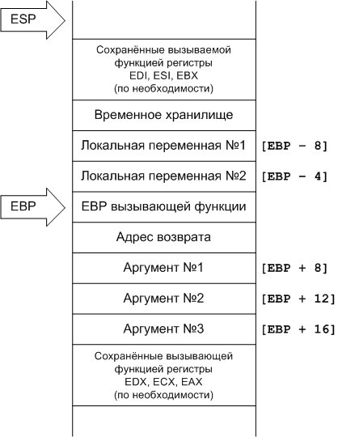
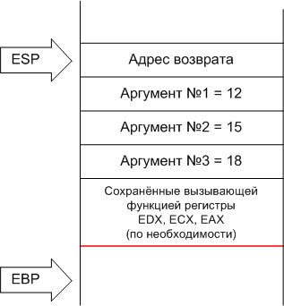
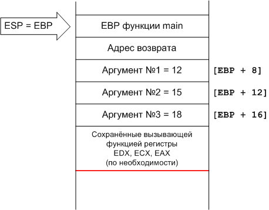
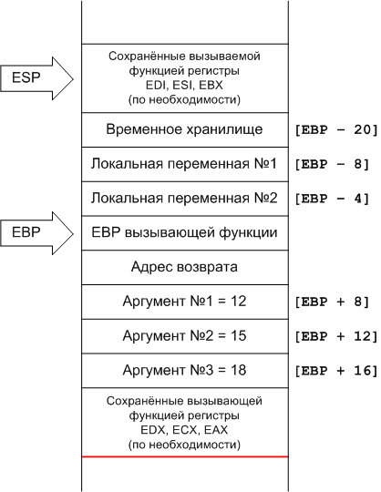
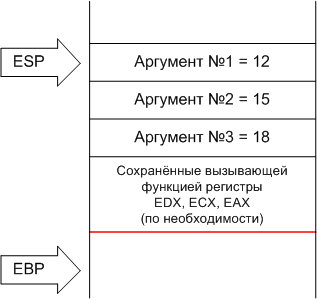

# Реализация вызова функции
## Введение

Эта статья - перевод этой статьи. Некоторые детали в ней устарели,
некоторые являются специфичными для окружения, но в целом полно излагают поведение при вызове функции. Данный материал позволит глубже понять
механизм вызова, специфичные ошибки, особенности вызова функций с переменным числом параметров и возможные методы оптимизации. Кроме того, она будет
полезна, если вы захотите вызвать функцию или написать собственную на ассемблере.

Ниже описано поведение стека при вызове функции в си. Детали соответствуют действительности для компилятора gcc на платформе intel pentium. Существует
множество способов и соглашений создать и заполнить фрейм: разные процессоры, операционные системы и компиляторы могут делать это по-разному.

## Вызов функции

Рассмотрим функцию со следующим прототипом
int foo (int arg1, int arg2, int arg3);
Функция имеет 2 локальных переменных. Далее будем считать, что sizeof(int) равен 4 байтам. Пусть функция main вызывает функцию foo.
Регистр ESP является указателем стека (хранит адрес вершины стека), регистр EBP - указателем базы. Регистр EBP используется для хранения адреса предыдущего фрейма. 
Аргументы, которые main передаёт foo, а также локальные переменные могут быть получены путём сдвига относительно указателя базы.

Если вызываемая функция работает с регистрами EAX, ECX и EDX, то вызывающая функция должна их сохранить каким-то образом на стеке перед вызовом подпрограммы. 
С другой стороны, вызываемая функция должна восстановить значения этих регистров. Если вызываемая функция изменяет состояние регистров EAX, ECX и EDX, то она 
должна сначала сохранить предыдущее состояние на стеке, а перед выходом восстановить их прежние значения.

Параметры, передаваемые функции foo кладутся на стек справа налево: сначала самый последний аргумент, в конце самый первый. Локальные переменные, также как и временные, 
хранятся на стеке.



Возвращаемое значение, если оно меньше 4 байт, сохраняется в регистре EAX. Если возвращаемое значение больше четырёх байт, то вызывающая функция передаёт дополнительный первый параметр вызываемой функции. Этот параметр - адрес, по которому должно быть сохранено возвращаемое значение. На языке си вызов

x = foo(a, b, c);
будет трансформирован в
foo(&x, a, b, c);
Заметьте, это произойдёт только если возвращаемое значение больше 4 байт.

Рассмотрим пошагово процесс вызова и понаблюдаем за изменением стека.

## Действия вызывающей функции перед вызовом

В нашем примере вызывающая функция main, а вызываемая foo. Перед вызовом функции main использует регистры ESP и EBP для работы с собственным фреймом.
1. Функция main кладёт на стек содержимое регистров EAX, ECX и EDX. Это необязательное действие, которое происходит только если состояние регистров должно быть сохранено.
2. Функция main кладёт на стек аргументы, начиная с последнего. Например, если вызов имеет вид
a = foo(12, 15, 18);
на ассемблере это может выглядеть как:

```
push    dword 18 
push    dword 15
push    dword 12
```

3. main запрашивает вызов подпрограммы call

```
call    foo
```



Во время исполнения инструкции call, на стек кладётся содержимое регистра EIP (Istruction pointer). Смысл вот  в чём: так как EIP указывает на следующую инструкцию после в 
main, то на вершине стека окажется адрес возврата. После вызова call следующий цикл выполнения начнётся  с метки foo.

На рисунке 2 показано содержимое фрейма после того, как отработала функция call. Красная линия на этом и следующих рисунках отделяет содержимое стека, которое было
создано вызовом функции от остального содержимого. После вызова функции вершина стека вновь окажется на этой позиции.

## Действия вызываемой функции после вызова

Когда функция foo получает управление, она должна сделать 3 вещи: установить собственный фрейм, выделить место под локальное хранилище, по мере надобности сохранить 
состояние регистров EBX, ESI и EDI.

Итак,  foo сначала устанавливает собственный фрейм. EBP ещё указывает на положение фрейма функции main. Это значение должно быть сохранено, поэтому оно 
кладётся на стек. Содержимое ESP перемещается в EBP. Это позволит обращаться к аргументам функции как к сдвигу относительно EBP и освободит указатель 
стека ESP для дальнейших действий. Поэтому, почти все функции си начинаются с инструкций

```
push    ebp
mov     ebp, esp
```

На рисунке 3 изображён стек после этих действий. Обратите внимание, что первый аргумент имеет адрес EBP + 8, так как адрес возврата и EBP функии main каждый занимают по 4 байта.



На следующем шаге функция foo должна выделить на стеке место под локальные переменные. Также она должна выделить место под временное хранилище. Дело в том, что  
функция может иметь сложные выражения, которые будут сохранять промежуточные значения для дальнейшего использования в других сложных выражениях. 
Пусть, к примеру, кроме двух локальных переменных типа int нашей функции требуется ещё 12 байт для временного хранилища. Необходимые 20 байт 
могут быть выделены просто вычитанием из EBP двадцати (напомню, вершина стека растёт с убыванием адреса)

```
sub     esp, 20
```

К локальным переменным и временному хранилищу теперь можно обращаться с помощью сдвига относительно EBP.
В заключение, foo должна сохранить содержимое регистров EBX, ESI и EDI на стеке , если они используются.



Теперь может быть выполнено тело функции. При этом новые данные могут помещаться и сниматься со стека. Поэтому указатель стека ESP может изменяться, но EBP 
остаётся фиксированным, и к первому аргументу можно обратиться [EBP + 8] независимо от того, сколько операций push и pop было вызвано.
Выполнение функции foo в свою очередь также может привести к вызову других функций или к рекурсивному вызову. Тем не менее, поскольку EBP 
восстанавливается после возвращения из этих вложенных вызовов, ссылки на аргументы, локальные переменные и временное хранилище всё также может быть произведено с помощью 
сдвига относительно EBP.

## Действия вызываемой функции перед возвратом

Перед тем как вернуть управление вызывающей функции, foo должна определиться  с тем, как возвращать значение, о чём мы уже упоминали. Результат будет 
помещён в регистр EAX, либо станет дополнительным параметром функции, а сама функция не будет возвращать значения.

Во-вторых, foo должна восстановить значение регистров EBX, ESI и EDI. В начале вызова мы поместили значения регистров на стек (так как наша функция их изменяла), 
а теперь можем снять эти значения оттуда, но только в том случае, если ESP хранит верное значение, то есть количество операция push и pop должно быть сбалансировано.

После этих двух шагов локальные переменные и временное хранилище больше не нужны и фрейм может быть снят с помощью инструкций

```
mov     esp, ebp
pop     ebp
```



После этого адрес возврата может быть снят со стека и помещён в регистр EIP. Так как эти действия часто встречаются в программах на си, то процессоры i386 имеют 
специальные инструкции, которые делают то же самое, что и приведённые выше

```
leave
ret
```

## Действия вызывающей функции после возвращения

После того, как управление перешло к вызывающеё функции (в нашем примере это main), аргументы, переданные функции обычно уже не нужны. Мы можем снять со стека 
все три значения сразу, просто прибавив 12 (3 раза по 4 байта) к указателю стека.

```
add     esp, 12
```

Функция main после этого должна сохранить возвращаемое значение, которое хранится в регистре EAX в предназначенном для этого месте. Например, если возвращаемое 
значение присваивается переменной, то содержимое регистра EAX может быть размещено по адресу этой переменной.

В конце концов, если содержимое регистров EAX, ECX и EDX было сохранено на стеке, то оно может быть восстановлено. Таким образом, стек опять находится в том состоянии, в котором был до вызова функции.

