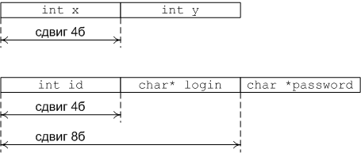

# Cтруктуры
## Введение

Мир вокруг можно моделировать различными способами. Самым естественным из них является представление о нём, как о наборе объектов. У каждого объекта есть свои свойства. 
Например, для человека это возраст, пол, рост, вес и т.д. Для велосипеда – тип, размер колёс, вес, материал, изготовитель и пр. Для товара в магазине – идентификационный номер, 
название, группа, вес, цена, скидка и т.д.

У классов объектов набор этих свойств одинаковый: все собаки могут быть описаны, с той или иной точностью, одинаковым набором свойств, но значения этих свойств будут разные.

Все самолёты обладают  набором общих свойств в пределах одного класса. Если же нам надо более точное описание, то можно выделить подклассы: самолёт амфибии, боевые 
истребители, пассажирские лайнеры – и в пределах уже этих классов описывать объекты.
Например, нам необходимо хранить информацию о сотрудниках компании. Каждый сотрудник, в общем, обладает большим количеством разных свойств. 
Мы выберем только те, которые нас интересуют для решения прикладной задачи: пол, имя, фамилия, возраст, идентификационный номер. Для работы с таким 
объектом нам необходима конструкция, которая бы могла агрегировать различные типы данных под одним именем. Для этих целей в си используются структуры.

## Объявление структуры

Синтаксис объявления структуры

```
struct <имя> {
	<тип1> <поле1>;
	<тип2> <поле2>;
	...
	<типN> <полеN>;
};
```

Например

```
struct point_t {
	int x;
	int y;
}; //Тут стоит точка с запятой!
```

Полями структуры могут быть любые объявленные типы, кроме самой структуры этого же типа, но можно хранить указатель на структуру этого типа:

```
struct node {
	void* value;
	struct node next;
};
```

Нельзя, нужно

```
struct node {
	void* value;
	struct node *next;
};
```

В том случае, если несколько полей имеют один тип, то их можно перечислить через запятую:

```
struct Point3D {
	int x, y, z;
};
```

После того, как мы объявили структуру, можно создавать переменную такого типа с использованием служебного слова struct. Доступ до полей структуры осуществляется с 
помощью операции точка:

```
#include <conio.h>
#include <stdio.h>
#include <math.h>

struct point_t {
	int x;
	int y;
};

void main() {
	struct point_t A;
	float distance;

	A.x = 10;
	A.y = 20;

	distance = sqrt((float) (A.x*A.x + A.y*A.y));

	printf("x = %.3f", distance);
	getch();
}
```

Структура, объявленная в глобальном контексте, видна всем. Структура также может быть объявлена внутри функции:

```
#include <conio.h>
#include <stdio.h>
#include <math.h>

void main() {
	struct point_t {
		int x;
		int y;
	};
	struct point_t A;
	float distance;

	A.x = 10;
	A.y = 20;

	distance = sqrt((float) (A.x*A.x + A.y*A.y));

	printf("x = %.3f", distance);
	getch();
}
```

Можно упростить пример: синтаксис языка позволяет создавать экземпляры структуры сразу же после определения:

```
struct point_t {
		int x;
		int y;
	} A;
	float distance;
```

Структура также может быть анонимной. Тогда мы не сможем использовать имя структуры в дальнейшем.

```
#include <conio.h>
#include <stdio.h>
#include <math.h>

void main() {
	struct {
		int x;
		int y;
	} A;
	float distance;

	A.x = 10;
	A.y = 20;

	distance = sqrt((float) (A.x*A.x + A.y*A.y));

	printf("x = %.3f", distance);
	getch();
}
```

В этом примере мы создали переменную A. Она является структурой с двумя полями.

## Начальная инициализация структур

Структуру можно инициализировать во время создания как массив. Поля в этом случае будут присваиваться по порядку.

```
#include <conio.h>
#include <stdio.h>
#include <math.h>

struct gasket {
	float weight;
	unsigned height;
	unsigned diameter;
};

void main() {
	struct gasket obj = { 12.f, 120, 30 };

	printf("gasket info:\n");
	printf("-------------------\n");
	printf("weight: %4.3f kg\n", obj.weight);
	printf("height: %6d cm\n", obj.height);
	printf("diameter: %4d cm\n", obj.diameter);

	getch();
}
```

Замечание: таким образом можно только иницализировать структуру. Присваивать значение всей структуре таким образом нельзя.

Современный стандарт си позволяет инициализировать поля структуры по имени. Для этого используется следующий синтакис:

```
#include<stdio.h>

typedef struct thing {
    int a;
    float b;
    const char *c;
} thing_t;

int main() {
    thing_t t = {
        .a = 10,
        .b = 1.0,
        .c = "ololololo"
    };
    printf("%s\n", t.c);
    printf("%d\n", t.a);
    printf("%f\n", t.b);
    _getch();
}
```

## Определение нового типа

Когда мы определяем новую структуру с помощью служебного слова struct, в пространстве имён структур (оно не имеет ничего общего с пространствами имён С++) создаётся новый  идентификатор. Для доступа к нему необходимо использовать служебное слово struct.
Можно определить новый тип с помощью служебного слова typedef. Тогда будет создан псевдоним для нашей структуры, видимый в глобальном контексте.

```
#include <conio.h>
#include <stdio.h>

//Определяем новую структуру
struct point_t {
	int x;
	int y;
};

//Определяем новый тип
typedef struct point_t Point;

void main() {
	//Обращение через имя структуры
	struct point_t p = {10, 20};
	//Обращение через новый тип
	Point px = {10, 20};

	getch();
}
```

Теперь при работе с типом Point нет необходимости каждый раз писать слово struct. Два объявления можно объединить в одно

```
typedef struct point_t {
	int x;
	int y;
} Point;
```

Замечание. Если мы создаём новый тип-структуру, полем которого является указатель на этот же тип, то его необходимо объявлять явно с использованием служебного слова struct

```
typedef struct Node {
	int value;
	struct Node *next;
} Node;
```

## Указатели на структуру

Указатель на структуру создаётся как обычно. Отличие заключается в том, что можно обращаться к полям структуры через указатель с помощью операции "стрелка" (минус + больше). 
Пример – пользователь вводит число – размер массива пользователей. Поле этого вводит для каждого из них логин и пароль. Третье поле - идентификатор – задаётся 
автоматически. После этого все пользователи выводятся на экран.

```
#include <conio.h>
#include <stdio.h>
#include <stdlib.h>
#include <string.h>

#define MAX_SIZE 20

typedef struct User {
	char *login;
	char *password;
	int id;
} User;

void jsonUser(User *user) {
	printf("{id: %d, login: \"%s\", password: \"%s\"}\n", 
			user->id, user->login, user->password);
}

void freeUsersArray(User** users, unsigned size) {
	unsigned i;
	for (i = 0; i < size; i++) {
		free((*users)[i].login);
		free((*users)[i].password);
	}
	free(*users);
}

void main() {
	User *users = NULL;
	unsigned size;
	char buffer[128];
	unsigned i;

	printf("Enter number of users: ");
	scanf("%d", &size);

	size = size <= MAX_SIZE? size: MAX_SIZE;
	users = (User*) malloc(size * sizeof(User));

	for (i = 0; i < size; i++) {
		printf("user #%d\nname: ", i);
		scanf("%127s", buffer);
		users[i].id = i;
		users[i].login = (char*) malloc(strlen(buffer) + 1);
		strcpy(users[i].login, buffer);
		printf("password: ");
		scanf("%127s", buffer);
		users[i].password = (char*) malloc(strlen(buffer) + 1);
		strcpy(users[i].password, buffer);
	}

	for (i = 0; i < size; i++) {
		jsonUser(&users[i]);
	}

	freeUsersArray(&users, size);
	getch();
}
```

Обратите внимание на удаление массива структур: при удалении экземпляра структуры он не удаляет своих полей самостоятельно, поэтому необходимо сначала 
удалять поля, после этого удалять сам массив.
При вызове функции jsonUser мы передаём указатель на экземпляр структуры, поэтому внутри функции доступ до полей осуществляется с помощью оператора стрелка.

## Устройство структуры в памяти

Поля структуры расположены в памяти друг за другом. Тип поля определяет сдвиг относительно предыдущего поля. Имя поля - это сдвиг относительно адреса экземпляра.
На самом деле размер структуры не всегда равен сумме размеров её полей: это связано с тем, что компилятор оптимизирует расположение структуры в памяти и может поля 
небольшого размера подгонять до чётных адресов.



```
#include <conio.h>
#include <stdio.h>

struct Test1 {
	char a;
	char b;
	int c;
} A;

struct Test2 {
	int x;
	int y;
} B;

struct Test3 {
	char a;
	char b;
	char c;
	int d;
} C;

void main() {
	printf("sizeof(A) = %d\n", sizeof(A));
	printf("sizeof(B) = %d\n", sizeof(B));
	printf("sizeof(C) = %d\n", sizeof(C));

	getch();
}
```

Первая структура должна иметь размер 6 байт, вторая 8 байт, третья 7 байт, однако на 32-разрядной машине компилятор VC сделает их все три равными 8 байт.
Стандарт гарантирует, что поля расположены друг за другом, но не гарантирует, что непрерывно.

Есть возможность изменить упаковку структур в памяти. Можно явно указать компилятору каким образом производить упаковку полей структуры, объединений или полей класса. Каким
образом это делать, зависит от компилятора. Один из самых распространённых способов прагма pack()

```
#pragma pack(n)
```

Использование #pragma pack не приветствуется: логика работы программы не должна зависить от внутреннего представления структуры (если, конечно, вы не занимаетесь
системным программированием или ломаете чужие программы и сети).

## Приведение типов

Стандартом поведение при приведении одной структуры к другой не определено. Это значит, что даже если структуры имеют одинаковые поля, то нельзя явно 
кастовать одну структуру до другой.

```
#include <conio.h>
#include <stdio.h>

struct Point {
	int x;
	int y;
};

struct Apex {
	int a;
	int b;
};

void main() {
	struct Point point = {10, 20};
	struct Apex apex;

	apex = (*(struct Apex*)(&point));

	printf("a = %d, b = %d", apex.a, apex.b);

	getch();
}
```

Этот пример работает, но это хак, которого необходимо избегать. Правильно писать так

```
void main() {
	struct Point point = {10, 20};
	struct Apex apex;

	apex.a = point.x;
	apex.b = point.y;

	printf("a = %d, b = %d", apex.a, apex.b);

	getch();
}
```

Привести массив к структуре (или любому другому типу) по стандарту также невозможно (хотя в различных компиляторах есть для этого инструменты).
Но в си возможно всё.

```
#include <conio.h>
#include <stdio.h>

struct Point {
	int x;
	int y;
};

void main() {
	struct Point point = {10, 20};
	int x[3] = {300, 400, 500};

	point = (*(struct Point*)(x));

	printf("a = %d, b = %d", point.x, point.y);

	getch();
}
```

Но запомните, что в данном случае поведение не определено.

## Вложенные структуры

Структура сама может являться полем структуры. Пример: структура Model – модель автомобиля, имеет название, номер, год выпуска и поле Make, которое в 
свою очередь хранит номер марки и её название.

```
#include <conio.h>
#include <stdio.h>
#include <stdlib.h>
#include <string.h>

#define YEAR_OFFSET 1890

typedef struct Model {
	int id;
	struct {
		int id;
		char *name;
	} make;
	char *name;
	unsigned char year; //year is an offset to 1890
} Model;

char* mallocByString(const char *str) {
	char* p = (char*) malloc(strlen(str) + 1);
	strcpy(p, str);
	return p;
}

void freeModel(Model* model) {
	free(model->make.name);
	free(model->name);
}

void xmlModel(Model *model) {
	printf(
"<model id=\"%d\">\n"
"    <make id=\"%d\">\n"
"        <name>%s</name>\n"
"    </make>\n"
"    <year>%d</year>\n"
"    <name>%s</nam>>\n"
"</model>", model->id, model->make.id, model->make.name, model->year, model->name);
}

int main() {
	
	Model cl;
	cl.id = 1;
	cl.make.id = 1;
	cl.make.name = mallocByString("Acura");
	cl.name = mallocByString("CL");
	cl.year = (2003 - YEAR_OFFSET);

	xmlModel(&cl);
	freeModel(&cl);

	getch();
}
```

Вложенные структуры инициализируются как многомерные массивы. В предыдущем примере можно произвести начальную инициализацию следующим образом:

```
#include <stdio.h>
#include <conio.h>

typedef struct Model {
    int id;
    struct {
        int id;
        char *name;
    } make;
    char *name;
    unsigned char year; //year is an offset to 1890
} Model;

void main() {
	Model m = {10, {10, "Acura"}, "CL", 112};
	printf("Model name = %s\n", m.name);
	printf("Make name = %s\n", m.make.name);
	getch();
}
```

P.S. подобным образом инициализировать строки не стоит, здесь так сделано только для того, чтобы упростить код.

## Указатели на поля структуры и на вложенные структуры

Указатели на поля структуры определяются также, как и обычные указатели. Указатели на вложенные структуры возможны только тогда,
когда структура определена. Немного переделаем предыдущий пример: "деанонимизируем" вложенную безымянную структуру и
возьмём указатели на поля структуры Model:

```
#include <conio.h>
#include <stdio.h>
#include <stdlib.h>
#include <string.h>

#define YEAR_OFFSET 1890

//Отдельно выделили структуру "Марка"
typedef struct Make {
	int id;
    char *name;
} Make;

//Теперь полем структуры "Модель" является структура "Марка"
typedef struct Model {
    int id;
	Make make;
    char *name;
    unsigned char year; //year is an offset to 1890
} Model;

char* mallocByString(const char *str) {
    char* p = (char*) malloc(strlen(str) + 1);
    strcpy(p, str);
    return p;
}
 
void freeModel(Model* model) {
    free(model->make.name);
    free(model->name);
}

void main() {
	Make *make = NULL;
	Model cl;
	int *id;

    cl.id = 2;
    cl.make.id = 1;
    cl.make.name = mallocByString("Acura");
    cl.name = mallocByString("CL");
    cl.year = (2003 - YEAR_OFFSET);

	//Получаем указатель на вложенную структуру
	make = &cl.make;
	//Получаем указатель на поле структуры
	id = &cl.id;
	printf("make.name = %s\n", make->name);
	printf("make.id = %d\n", make->id);
	printf("model.id = %d\n", *id);

	freeModel(&cl);
	scanf("1");
}
```

Как уже говорилось ранее, в си, даже если у двух структур совпадают поля, но структуры имеют разные имена, то их нельзя приводить к одному типу. Поэтому
приходится избавляться от анонимных вложенных структур, если на них нужно взять указатель. Можно попытаться взять указатель типа char*
на поле структуры, но нет гарантии, что поля будут расположены непрерывно.

## Примеры

1. Стек, реализованный с помощью структуры "Узел", которая хранит значение (в нашем примере типа int) и указатель на следующий узел. Это неэффективная реализация, которая
требует удаления и выделения памяти под узел при каждом вызове операции push и pop.

```
#include <stdlib.h>
#include <stdio.h>
#include <conio.h>

#define STACK_OVERFLOW  3
#define STACK_UNDERFLOW 4

/**
Узел ссылается на предыдущий элемент стека.
Если узел ссылается на NULL, то это последний элемент стека
*/
typedef struct Node {
	int value;
	struct Node *next;
} Node;

/**
Создаём новый узел и делаем его вершиной стека.
*/
void push(Node *head, int val) {
	Node *tmp = NULL;
	if (!(tmp = (Node*) malloc(sizeof(Node)))) {
		exit(STACK_OVERFLOW);
	}
	tmp->next  = head->next;
	tmp->value = head->value;
	head->value = val;
	head->next  = tmp;
}

/**
Возвращаем значение текущей вершиныи удаляем её
*/
int pop(Node **head) {
	Node *tmp = (*head)->next;
	int val = (*head)->value;
	if ((*head)->next == NULL) {
		exit(STACK_UNDERFLOW);
	}
	free(*head);
	(*head) = tmp;
	return val;
}

/**
Удаляем все вершины
*/
void freeList(struct Node **head) {
	Node *tmp = NULL;
	while ((*head)->next) {
		tmp = (*head)->next;
		free(*head);
		(*head) = tmp;
	}
}

/**
Для того, чтобы получить последний элемент, необходимо
по цепочке пройти до него
*/
Node* getLast(struct Node *head) {
	Node* tmp;
	tmp = head -> next;
	while (tmp) {
		tmp = tmp -> next;
	}
	return tmp;
}

void main(){
	Node *head = NULL;
	int i;
	
	head = (Node*)malloc(sizeof(Node));
	head -> next = NULL;

	push(head, 100);
	push(head, 300);
	printf("%d\n", pop(&head));
	push(head, 200);
	push(head, 1000);

	while (head->next) {
		printf("%d\n", pop(&head));
	}

	free(head);
	getch();
}
```

2. Реализуем структуру - массив, и некоторые операции для работы с массивами. Тип массива зададим макроподстановкой.

```
#include <conio.h>
#include <stdio.h>
#include <stdlib.h>

#define TYPE int
#define OUT_OF_MEMORY_EXCEPTION 3
#define INDEX_OUT_OF_BOUNDS_EXCEPTION 4

typedef struct IntArr {
	TYPE *data;
	unsigned size;
} IntArr;

IntArr* create(unsigned size) {
	IntArr *tmp = NULL;
	if (!(tmp = (IntArr*) malloc(sizeof(IntArr)))) {
		exit(OUT_OF_MEMORY_EXCEPTION);
	}
	if (!(tmp->data = (int*) malloc(size * sizeof(TYPE)))) {
		exit(OUT_OF_MEMORY_EXCEPTION);
	}
	tmp->size = size;
	return tmp;
}

//Получаем элемент массива. Если индекс положительный,
//то возвращаем элемент по индексу, если отрицательный, то
//возвращаем по индексу с конца
TYPE get(IntArr* arr, int index) {
	if (index < 0) {
		unsigned realIndex = arr->size + index;
		if (realIndex < arr->size) {
			return arr->data[realIndex];
		} else {
			exit(INDEX_OUT_OF_BOUNDS_EXCEPTION);
		}
	} else {
		if (index < arr->size) {
			return arr->data[index];
		} else {
			exit(INDEX_OUT_OF_BOUNDS_EXCEPTION);
		}
	}
}

TYPE set(IntArr* arr, int index, TYPE value) {
	if (index < 0) {
		unsigned realIndex = arr->size + index;
		if (realIndex < arr->size) {
			return (arr->data[realIndex] = value);
		} else {
			exit(INDEX_OUT_OF_BOUNDS_EXCEPTION);
		}
	} else {
		if (index < arr->size) {
			return (arr->data[index] = value);
		} else {
			exit(INDEX_OUT_OF_BOUNDS_EXCEPTION);
		}
	}
}

//Заполнить массив нулями
void zeros(IntArr* arr) {
	unsigned i;
	for (i = 0; i < arr->size; i++) {
		arr->data[i] = 0;
	}
}

//Удаление элементов массива
void clearArr(IntArr* arr) {
	free(arr->data);
	arr->data = NULL;
}

void freeArr(IntArr **arr) {
	clearArr(*arr);
	free(*arr);
	arr = NULL;
}

void resizeArr(IntArr* arr, unsigned newSize) {
	if (!(arr->data = (int*) realloc(arr->data, newSize * sizeof(TYPE)))) {
		exit(OUT_OF_MEMORY_EXCEPTION);
	}
	arr->size = newSize;
}

void main() {
	int i;
	IntArr *arr = create(20);
	for (i = 0; i < 20; i++) {
		set(arr, i, i*i);
	}
	resizeArr(arr, 10);
	for (i = 0; i < 10; i++) {
		printf("%d ", get(arr, i));
	}
	printf("\nelement -3 is %d", get(arr, -3));
	printf("\nelement 0 is %d", get(arr, 0));
	set(arr, 0, 555);
	printf("\nelement 0 is %d", get(arr, 0));
	
	freeArr(&arr);
	getch();
}
```

3. Структура Линия, состоит из двух структур точек. Для краткости реализуем только пару операций

```
#include <conio.h>
#include <stdio.h>
#include <stdlib.h>
#include <math.h>

typedef struct Point {
	int x;
	int y;
} Point;

typedef struct Line {
	Point *begin;
	Point *end;
} Line;

Line* lineByCrds(int x1, int y1, int x2, int y2) {
	Line *tmp = (Line*) malloc(sizeof(Line));
	tmp->begin = (Point*) malloc(sizeof(Point));
	tmp->end   = (Point*) malloc(sizeof(Point));
	tmp->begin->x = x1;
	tmp->begin->y = y1;
	tmp->end->x = x2;
	tmp->end->y = y2;
	return tmp;
}

/**
Мы храним указатели на Point, поэтому нельзя просто
скопировать p1 и p2, необходимо копировать содержимое
аргументов, чтобы в случае их удаления содержимое нашей линии
не исчезло
*/
Line* lineByPoints(const Point* p1, const Point* p2) {
	Line *tmp = (Line*) malloc(sizeof(Line));
	tmp->begin = (Point*) malloc(sizeof(Point));
	tmp->end   = (Point*) malloc(sizeof(Point));
	*(tmp->begin) = *p1;
	*(tmp->end)   = *p2;
	return tmp;
}

Line* add(const Line* line1, const Line* line2) {
	Line *tmp = (Line*) malloc(sizeof(Line));
	tmp->begin = (Point*) malloc(sizeof(Point));
	tmp->end   = (Point*) malloc(sizeof(Point));
	tmp->begin->x = line1->begin->x;
	tmp->begin->y = line1->begin->y;
	tmp->end->x = line2->end->x;
	tmp->end->y = line2->end->y;
	return tmp;
}

void addTo(Line *line1, const Line* line2) {
	line1->end->x = line2->end->x;
	line1->end->y = line2->end->y;
}

Line* copyLine(const Line* line) {
	Line * tmp = (Line*) malloc(sizeof(Line));
	tmp->begin = (Point*) malloc(sizeof(Point));
	tmp->end   = (Point*) malloc(sizeof(Point));
	*(tmp->begin) = *(line->begin);
	*(tmp->end) = *(line->end);
	return tmp;
}

float length(const Line* line) {
	int x = line->end->x - line->begin->x;
	int y = line->end->y - line->begin->y;
	return sqrt((float) (x*x + y*y));
}

float tangent(const Line* line) {
	return 
		(float) (line->end->y - line->begin->y) / 
		(float) (line->end->x - line->begin->x);
}

void freeLine(Line **line) {
	free((*line)->begin);
	free((*line)->end);
	free(*line);
	*line = NULL;
}

void main() {
	Point *p1 = (Point*) malloc(sizeof(Point));
	Point *p2 = (Point*) malloc(sizeof(Point));
	Line *line = NULL;
	Line *other = NULL;
	p1->x = 10;
	p1->y = 10;
	p2->x = 20;
	p2->y = 20;
	//Создадим линию из точек
	other = lineByPoints(p1, p2);
	p1->x = 3000;
	p1->y = 4000;
	//Удаляем точки. Так как в линию было скопировано
	//содержимое, а не указатели, то она не изменилась
	free(p2);
	free(p1);
	//Создали копию линии. Так как мы скопировали содержимое
	//полностью, то line после удаления other не изменится
	line = copyLine(other);
	freeLine(&other);
	printf("%d %d %d %d", line->begin->x, line->begin->y, line->end->x, line->end->y);
	printf("\nlength = %.3f", length(line));
	printf("\ntan = %.3f", tangent(line));
	freeLine(&line);
	getch();
}
```

Обратите внимание на операции создания и копирования линии. Обязательно нужно копировать содержимое, иначе при изменении или удалении объектов, которые мы получили в качестве аргументов, наша линия также изменится.
Если структура содержит другие структуры в качестве полей, то необходимо проводить копирование содержимого всех полей. Глубокое копирование позволяет избежать неявных зависимостей.

4. Структура комплексное число и функции для работы с ней.

```
#include <conio.h>
#include <stdio.h>
#include <stdlib.h>
#include <math.h>

typedef struct Complex {
	float Re;
	float Im;
} Complex;

Complex* complex(float Re, float Im) {
	Complex* _this = (Complex*) malloc(sizeof(Complex));
	_this->Im = Im;
	_this->Re = Re;
	return _this;
}

Complex* copy(const Complex *origin) {
	Complex* _this = complex(origin->Re, origin->Im);
	return _this;
}

void set(Complex *_this, float Re, float Im) {
	_this->Re = Re;
	_this->Im = Im;
}

void addTo(Complex *_this, const Complex *summand) {
	_this->Re += summand->Re;
	_this->Im += summand->Im;
}

void subFrom(Complex *_this, const Complex *subtrahend) {
	_this->Re -= subtrahend->Re;
	_this->Im -= subtrahend->Im;
}

void mulBy(Complex *_this, const Complex *factor) {
	float tmpRe = (_this->Re * factor->Re) - (_this->Im * factor->Im);
	_this->Im = (_this->Im * factor->Re) + (_this->Re * factor->Im);
	_this->Re = tmpRe;
}

void divBy(Complex *_this, const Complex *divisor) {
	float tmp = divisor->Im * divisor->Im + divisor->Re * divisor->Re;
	float tmpRe = _this->Re = (_this->Re*divisor->Re + _this->Im * divisor->Im) / tmp;
	_this->Im = (_this->Im*divisor->Re - _this->Re * divisor->Im) / tmp;
	_this->Re = tmpRe;
}

void deleteComplex(Complex **cmp) {
	free(*cmp);
	cmp = NULL;
}

void main() {
	Complex *a = complex(1, 3);
	Complex *b = complex(-1, 2);
	addTo(a, b);
	printf("a + b = %.3f, %.3fi}\n", a->Re, a->Im);
	set(a, 1, 3);
	subFrom(a, b);
	printf("a - b = %.3f, %.3fi}\n", a->Re, a->Im);
	set(a, 1, 3);
	mulBy(a, b);
	printf("a * b = %.3f, %.3fi}\n", a->Re, a->Im);
	set(a, 1, 3);
	divBy(a, b);
	printf("a / b = %.3f, %.3fi}", a->Re, a->Im);
	set(a, 1, 3);
	deleteComplex(&a);
	deleteComplex(&b);
	getch();
}
```

5. Биномиальная куча и сортировка на куче

```
#include <stdlib.h>
#include <stdio.h>
#include <conio.h>
#include <string.h>
#include <stddef.h>
#include <math.h>

const size_t MIN_LIMIT  = 10;
const size_t MIN_FACTOR = 10;

/**
@data	- массив для хранения элементов
@size	- текущее количество элементов в куче
@factor - значение, на которое будет увеличиваться массив в случае переполнения
@limit	- максимальное количество элементов в куче. При превышении 
          будет происходить увеличение массива
*/
typedef struct heap{
	int *data;
	size_t size;
	size_t factor;
	size_t limit;
} heap;

void checkSize(heap **h){
	if ((*h)->size >= (*h)->limit) {
		(*h)->limit += (*h)->factor;
		(*h)->data = (int*) realloc((*h)->data, (*h)->limit*sizeof(int));
	}
}

int deleteRoot(struct heap *h){
	unsigned int i;
	unsigned int c;
	int t;
	int k;
	int retVal = h->data[0];
	
	t = h->data[0];
	h->data[0] = h->data[h->size - 1];
	h->data[h->size - 1] = t;
	h->size--;
	i = 0;
	while (i < h->size) {
		c = 2*i + 1;
		if (c>=h->size)
			break;
		if (c+1 < h->size) {
			if (h->data[c] < h->data[c+1]) {
				c++;
			}
		}
		if (h->data[c]>h->data[i]) {
			int temp = h->data[c];
			h->data[c]=h->data[i];
			h->data[i]=temp;
			i = c;
		} else {
			break;
		}
	}
	return retVal;
}

void insert(heap *h, int value) {
	unsigned int i = h->size;
	unsigned int p;
	checkSize(&h);
	h->data[i] = value;
	while (i>0) {
		p = (unsigned int)floor((i-1)/2.0);
		if (h->data[p] < h->data[i]) {
			int temp = h->data[i];
			h->data[i] = h->data[p];
			h->data[p] = temp;
			i = p;
		} else {
			break;
		}
	}
	h->size++;
}

heap* createHeap(size_t limit, size_t factor) {
	heap *tmp;
	tmp = (heap*)malloc(sizeof(heap));
	tmp->limit  = (limit>0)? limit :MIN_LIMIT;
	tmp->factor = (factor>0)? factor: MIN_FACTOR;
	tmp->data = (int*) malloc(tmp->limit * sizeof(int));
	tmp->size = 0;
}

void sort(heap *h) {
	unsigned i;
	unsigned oldSize = h->size-1;
	for (i = 0; i < oldSize; i++) {
		h->data[oldSize-i] = deleteRoot(h);
	}
	h->size = oldSize;
}

void deleteHeap(heap **h) {
	free((*h)->data);
	free(*h);
	*h = NULL;
}

int main(){                                  
	int i;
	unsigned long begin;
	struct heap *h;

	h = createHeap(2, 10);
	for (i = 60; i >= -10; i--) {
		insert(h, i);
	}

	for (i = 0; i < 71; i++) {
		printf("%i ", h->data[i]);
	}

	printf("\n\n");

	sort(h);
	for (i = 0; i < 71; i++) {
		printf("%i ", h->data[i]);
	}

	deleteHeap(&h);
	getch();

}
```

