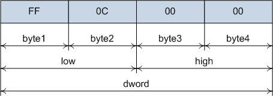

# Объединения и битовые поля
## Объединения

Объединения в си похожи на структуры, с той разницей, что все поля начинаются с одного адреса. 
Это значит, что размер объединения равен размеру самого большого его поля. Так как все поля начинаются с одного адреса, то 
их значения перекрываются. Рассмотрим пример:

```
#include <conio.h>
#include <stdio.h>

union Register32 {
	struct {
		unsigned char byte1;
		unsigned char byte2;
		unsigned char byte3;
		unsigned char byte4;
	} bytes;
	struct {
		unsigned short low;
		unsigned short high;
	} words;
	unsigned dword;
};

typedef union Register32 EAX;

void main() {
	EAX reg;
	reg.dword = 0x0000C0FF;
	printf("    dword \t%08x\n", reg.dword);
	printf(" low word \t%04x\n", reg.words.low);
	printf("high word \t%04x\n", reg.words.high);
	printf("    byte1 \t%02x\n", reg.bytes.byte1);	
	printf("    byte2 \t%02x\n", reg.bytes.byte2);	
	printf("    byte3 \t%02x\n", reg.bytes.byte3);	
	printf("    byte4 \t%02x\n", reg.bytes.byte4);	
	getch();
}
```

Здесь было создано объединение, которое содержит три поля – одно поле целого типа (4 байта), два поля типа short int (2 байта каждое) и 
4 поля по одному байту. После того, как значение было присвоено полю dword, оно также стало доступно и остальным полям.



Напоминаю, что на x86 байты располагаются справа налево. Все поля объединения "обладают" одинаковыми данными, но каждое поле имеет доступ 
только до своей части.
Вот ещё один пример: рассмотрим представление числа с плавающей точкой:

```
#include <conio.h>
#include <stdio.h>

union floatint{
	float f;
	int i;
};

void main() {
	union floatint u = {10.f};
	printf("%f\n", u.f);
	printf("%x\n", u.i);
	getch();
}
```

Обратите внимание, что объединение можно инициализировать, как и структуру. При этом значение будет приводиться к типу, 
который имеет самое первое поле. Сравните результаты работы

```
#include <conio.h>
#include <stdio.h>

union floatint{
	int i;
	float f;
};

void main() {
	union floatint u = {10.f};
	printf("%f\n", u.f);
	printf("%x\n", u.i);
	getch();
}
```

## Битовые поля

Битовые поля в си объявляются с помощью структур. Они позволяют получать доступ до отдельных битов или групп битов. 
Доступ до отдельных битов можно осуществлять и с помощью битовых операций, но использование битовых полей часто упрощает 
понимание программы.
Синтаксис объявления битового поля

```
struct <имя> {
	<тип> <имя>: <размер>;
	...
}
```

```
#include <conio.h>
#include <stdio.h>

struct byte {
	unsigned a0: 1;
	unsigned a1: 1;
	unsigned a2: 1;
	unsigned a3: 1;
	unsigned a4: 1;
	unsigned a5: 1;
	unsigned a6: 1;
	unsigned a7: 1;
};

void main() {
	struct byte x = {0, 0, 0, 1, 0, 0, 0, 0};
	x.a1 = 1;
	printf("sizeof byte = %d\n", sizeof(struct byte));
	printf("x.a1 = %d\n", x.a1);
	printf("x.a3 = %d\n", x.a3);
	printf("x.a5 = %d", x.a5);
	getch();
}
```

В этом примере каждое поле структуры обозначено как битовое поле, длина каждого поля равна единице. Обращаться к каждому полю можно 
также, как и к полю обычной структуры.
Битовые поля имеют тип unsigned int, так как имеют длину один бит. Если длина поля больше одного бита, то поле может 
иметь и знаковый целый тип.

```
#include <conio.h>
#include <stdio.h>

struct byte {
	signed char a: 4;
	signed char b: 4;
};

void main() {
	struct byte x = {-1, 3};
	printf("hex a = %x\n", x.a);
	printf("dec a = %d\n", x.a);
	printf("hex b = %x\n", x.b);
	printf("dec b = %d\n", x.b);
	getch();
}
```

Размер структуры, содержащей битовые поля, всегда кратен 8. То есть, если одно поле содержит 5 бит, а второе 4, то второе поле начинается с восьмого бита и три бита остаются неиспользованными.
Неименованное поле может иметь нулевой размер. В этом случае следующее за ним поле смещается так, чтобы добрать до 8 бит.
Если же адрес поля уже кратен 8 битам, то нулевое поле не добавит сдвига.
Кроме того, если имеются обычные поля и битовые поля, то первое битовое поле будет сдвинуто так, чтобы добрать до 8 бит.

```
#include <conio.h>
#include <stdio.h>

struct byte1 {
	char a;
	char b;
	char c;
};

struct byte2 {
	char a;
	char b;
	char c;
	unsigned d: 1;
};

struct byte3 {
	char a;
	char b;
	char c;
	unsigned d: 1;
	unsigned: 0;    //неименованое поле нулевого размера
	unsigned e: 1;
};

void main() {
	printf("sizeof byte1 = %d\n", sizeof(struct byte1));
	printf("sizeof byte2 = %d\n", sizeof(struct byte2));
	printf("sizeof byte3 = %d", sizeof(struct byte3));
	getch();
}
```

В этих примерах видно, что структура добирает даже не до 8 бит, а больше - до адреса, кратного 4 байтам.
Работать подобным образом, инициализируя каждое поле по отдельности, неудобно. Поэтому структуры с битовыми полями делают полем 
объединения, например:

```
#include <conio.h>
#include <stdio.h>

struct byte {
	unsigned a0: 1;
	unsigned a1: 1;
	unsigned a2: 1;
	unsigned a3: 1;
	unsigned a4: 1;
	unsigned a5: 1;
	unsigned a6: 1;
	unsigned a7: 1;
};

union Byte {
	unsigned char value;
	struct byte bitfield;
};

void main() {
	union Byte x;
	x.value = 10;
	printf("%d%d%d%d%d%d%d%d", x.bitfield.a7, x.bitfield.a6, x.bitfield.a5, x.bitfield.a4, x.bitfield.a3, 
							   x.bitfield.a2, x.bitfield.a1, x.bitfield.a0);
	getch();
}
```

Те же самые действия можно было сделать и с помощью обычного сдвига

```
#include <conio.h>
#include <stdio.h>

void main() {
	unsigned char c = 10;
	int i;
	for (i = 7; i > -1; i--) {
		printf("%d", (c >> i) & 1);
	}
	getch();
}
```

Рассмотрим ещё один пример – знакопостоянный сдвиг вправо. Сдвиг вправо (>>) выталкивает самый левый бит и справа записывает ноль. Из-за этого операцию сдвига вправо нельзя применить, например, для чисел со знаком, так как будет потерян бит знака.
Исправим ситуацию, сделаем знакопостоянный сдвиг: будем проверять последний бит числа (напомню, что мы работаем с архитектурой x86 и биты расположены «задом наперёд»)

```
int int_signed_shiftr(int32_t x) {
	union {
		int32_t int_f;
		struct {
			unsigned char: 8;
			unsigned char: 8;
			unsigned char: 8;
			unsigned char: 7;
			unsigned char le_sign: 1;
		} bitfield;
	} iss;
	unsigned sign_bit;
	iss.int_f = x;
	//Сохраняем бит перед сдвигом
	sign_bit = iss.bitfield.le_sign;
	iss.int_f = iss.int_f >> 1;
	//Возвращаем значение бита обратно
	iss.bitfield.le_sign = sign_bit;

	return iss.int_f;
}
```

Здесь я специально использовал тип int32_t (библиотека stdint.h), чтобы гарантировать размер переменных в 32 бита. Теперь можно вызвать функцию и посмотреть результат.

```
void main() {
	printf("%d\n", int_signed_shiftr(22));
	printf("%d\n", int_signed_shiftr(-22));
	printf("%d\n", int_signed_shiftr(25));
	printf("%d\n", int_signed_shiftr(-25));
	printf("%d\n", int_signed_shiftr(27));
	printf("%d\n", int_signed_shiftr(-27));

	getch();
}
```

Вывод

