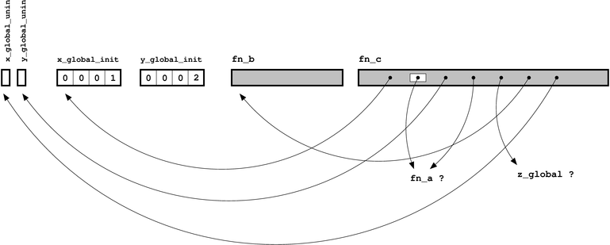
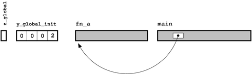
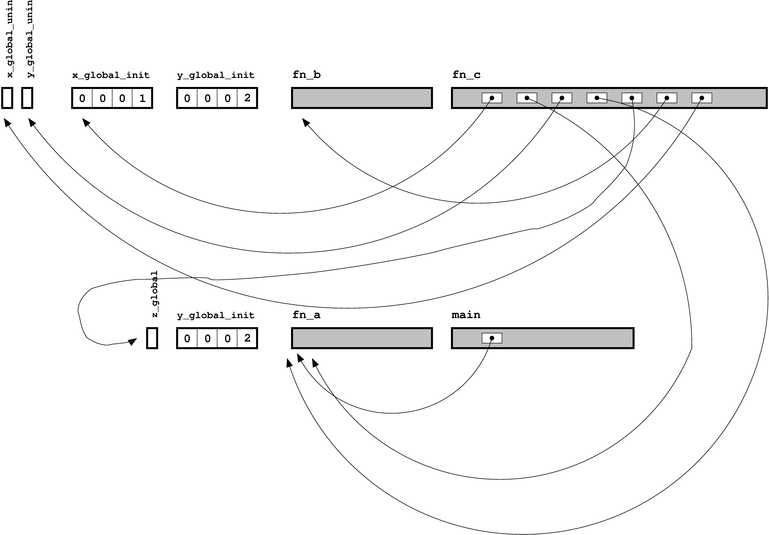
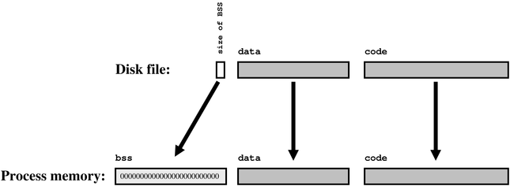
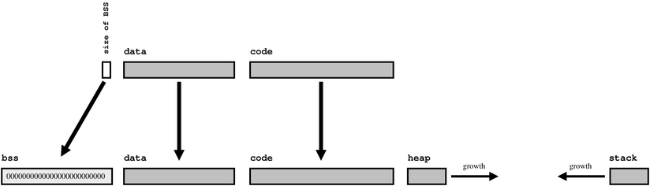

# Гид по линкерам для начинающих. Часть 1

Следующие понятия используются как синонимы: линкер и компоновщик, определение и дефиниция, объявление и декларирование. Серым выделены вставки с примерами.

## Именование составных частей: что внутри Си файла

Во-первых, необходимо понять разницу между объявление и определением. Определение связывает имя с реализацией этого имени, которая может быть как данными, так и кодом:

Объявление говорит компилятору Си, что где-то в программе, возможно, что и в другом файле, есть определение, связанное с этим именем (замечу, что определение сразу может быть и объявлением, для которого определение находится на том же месте).

Для переменных, определение бывает двух типов

Для ясности, «доступный» значит, что на переменную можно ссылаться по имени, которое связано с её определением.

Есть пара случаев, когда всё не так очевидно

Стоит сразу напомнить о том, что объявление функции статической уменьшает её область видимости до того файла, в котором она определена (именно, к ней могут обратиться функции из этого файла).

Локальных и глобальных переменные также можно разделить на неинициализированные и инициализированные (которые предварительно заполнены каким-то значением).

В конце концов, мы можем работать с переменными, созданными динамически с помощью функции malloc (или оператора new в С++). К области памяти по имени обратиться нельзя, поэтому мы используем указатели – именованные переменные, которые хранят адрес неименованного участка памяти. Этот участок может быть также освобождён с помощью free (или delete), поэтому считают, что память имеет динамическое размещение.

Соберём теперь всё вместе

Проще посмотреть на эту программу

```
/* Это определение неинициализированной глобальной переменной */
int x_global_uninit;

/* Это определение инициализированной глобальной переменной */
int x_global_init = 1;

/* Это определение неинициализированной глобальной переменной, 
но к ней можно обратиться по имени только из этого же си файла */
static int y_global_uninit;

/* Это определение инициализированной глобальной переменной, 
но к ней можно обратиться по имени только из этого же си файла */
static int y_global_init = 2;

/* Это объявление глобальной переменной, которая существует 
где-то в другом месте программы */
extern int z_global;

/* Это объявление функции, которая определена где-то в другом 
месте программы. Можно добавть служебное слово extern. Но это не имеет значения */
int fn_a(int x, int y);

/* Это определение функции, но так как она определена со 
словом static, то доступна только в этом же си файле */
static int fn_b(int x) {
  return x+1;
}

/* Это определение функции. Её параметтры рассматриваются 
как локальные переменные */
int fn_c(int x_local) {
  /* Это определение неинициализированной локальной переменной */
  int y_local_uninit;
  /* Это определение инициализированной локальной переменной */
  int y_local_init = 3;

  /* Этот код ссылает на локальные и глобальные переменные и функции по имени */
  x_global_uninit = fn_a(x_local, x_global_init);
  y_local_uninit = fn_a(x_local, y_local_init);
  y_local_uninit += fn_b(z_global);
  return (y_global_uninit + y_local_uninit);
}
```

Пусть этот файл называется file.c. Собираем так

```
cc -g -O -c file.c
```

Получим объектный файл file.o

## Что делает компилятор Си

Работа компилятора си в том, чтобы превратить файл с кодом из понимаемого (иногда) человеком в нечто, понимаемое компьютером. На выходе компилятор даёт объектный файл, который на  платформе UNIX имеет обычно расширение .o, а на windows .obj. Содержимое объектного файла это, по сути, два типа объектов

Экземпляры этих объектов будут иметь имена, связанные с ними – имена переменных или функций, определения которых привели к их генерации.

Объектный код – это последовательность (подходяще закодированных) машинных инструкций, соответствующих инструкциям на языке Си – всем этим if, while и даже goto. Все эти команды оперируют разного рода информацией, и эта информация должны быть где-то сохранена (для этого нужны переменные). Кроме того, они могут обращаться к другим кускам кода, который определён в файле.

Каждый раз, когда код обращается к функции или переменной, компилятор позволяет это делать только если он видел объявление этой переменной или функции. Объявление это обещание компилятору, что где-то в программе существует определение.

Работа компоновщика (линкера) в исполнении этих обещаний, но что делать компилятору, когда он сталкивается с неопределёнными сущностями?

По сути, компилятор просто оставляет заглушку. Заглушка (ссылка) имеет имя, но значения, связанного с ним, ещё не известно.

Теперь мы можем примерно описать, как будет выглядеть наша программа



## Анализ объектного файла

Пока мы работали с абстрактной программой;  теперь важно посмотреть ,как она выглядит на практике. На платформе UNIX можно воспользоваться утилитой nm. На Windows примерным аналогом служит dumpbin с флагом /symbols, хотя есть и порт GNU binutils, который включает nm.exe.

Посмотрим, что нам выдаст для написанной выше программы nm:

```
00000000 b .bss
00000000 d .data
00000000 N .debug_abbrev
00000000 N .debug_aranges
00000000 N .debug_info
00000000 N .debug_line
00000000 N .debug_loc
00000000 i .drectve
00000000 r .eh_frame
00000000 r .rdata$zzz
00000000 t .text
         U _fn_a
00000000 T _fn_c
00000000 D _x_global_init
00000004 C _x_global_uninit
         U _z_global
```

Для ранее скомпилированного файла file.o

```
nm file.o
```

От системы к системе вывод может отличаться, но ключевая информация – это класс каждого символа и его размер (если доступен). Класс может иметь следующие значения

Есть и другие гнусные классы, представляющие какие-то внутренние механизмы компилятора.

## Что делает компоновщик. Часть 1

Как мы уже определились ранее , объявление переменной или функции – это обещание компилятору, что где-то есть определение этой переменной или функции, и что работа линкера заключается в том, чтобы исполнять эти обещания. На нашей диаграммой объектного файла это также может быть названо «заполнением пустот».

Для иллюстрации этого вот вам ещё один си файл в дополнение к первому

```
/* Инициализированная глобальная переменная  */
int z_global = 11;
/* Вторая глобальная переменная с именем y_global_init, 
но обе они статические */
static int y_global_init = 2;
/* Объявление ещё одной глобальной переменной */
extern int x_global_init;

int fn_a(int x, int y)
{
  return(x+y);
}

int main(int argc, char *argv[])
{
  const char *message = "Hello, world";

  return fn_a(11,12);
}
```

Пусть этот файл называется main.c. Компилируем его как и ранее

```
cc –g –O –c main.c
```



С этими двумя диаграммами теперь мы видим, что все точки могут быть соединены (а если нет, то компоновщик выдаст ошибку). У каждой вещи своё место, и у каждого места есть вещь, и компоновщик может заменить все заглушки, как показано на рисунке.



Для ранее скомпилированных main.o и file.o сборка исполняемого файла

```
cc -o out.exe main.o file.o
```

Вывод nm для исполняемого файла  (в нашем случае out.exe):

```
Symbols from sample1.exe:

Name                  Value   Class        Type         Size     Line  Section

_Jv_RegisterClasses |        |   w  |            NOTYPE|        |     |*UND*
__gmon_start__      |        |   w  |            NOTYPE|        |     |*UND*
__libc_start_main@@GLIBC_2.0|        |   U  |              FUNC|000001ad|     |*UND*
_init               |08048254|   T  |              FUNC|        |     |.init
_start              |080482c0|   T  |              FUNC|        |     |.text
__do_global_dtors_aux|080482f0|   t  |              FUNC|        |     |.text
frame_dummy         |08048320|   t  |              FUNC|        |     |.text
fn_b                |08048348|   t  |              FUNC|00000009|     |.text
fn_c                |08048351|   T  |              FUNC|00000055|     |.text
fn_a                |080483a8|   T  |              FUNC|0000000b|     |.text
main                |080483b3|   T  |              FUNC|0000002c|     |.text
__libc_csu_fini     |080483e0|   T  |              FUNC|00000005|     |.text
__libc_csu_init     |080483f0|   T  |              FUNC|00000055|     |.text
__do_global_ctors_aux|08048450|   t  |              FUNC|        |     |.text
_fini               |08048478|   T  |              FUNC|        |     |.fini
_fp_hw              |08048494|   R  |            OBJECT|00000004|     |.rodata
_IO_stdin_used      |08048498|   R  |            OBJECT|00000004|     |.rodata
__FRAME_END__       |080484ac|   r  |            OBJECT|        |     |.eh_frame
__CTOR_LIST__       |080494b0|   d  |            OBJECT|        |     |.ctors
__init_array_end    |080494b0|   d  |            NOTYPE|        |     |.ctors
__init_array_start  |080494b0|   d  |            NOTYPE|        |     |.ctors
__CTOR_END__        |080494b4|   d  |            OBJECT|        |     |.ctors
__DTOR_LIST__       |080494b8|   d  |            OBJECT|        |     |.dtors
__DTOR_END__        |080494bc|   d  |            OBJECT|        |     |.dtors
__JCR_END__         |080494c0|   d  |            OBJECT|        |     |.jcr
__JCR_LIST__        |080494c0|   d  |            OBJECT|        |     |.jcr
_DYNAMIC            |080494c4|   d  |            OBJECT|        |     |.dynamic
_GLOBAL_OFFSET_TABLE_|08049598|   d  |            OBJECT|        |     |.got.plt
__data_start        |080495ac|   D  |            NOTYPE|        |     |.data
data_start          |080495ac|   W  |            NOTYPE|        |     |.data
__dso_handle        |080495b0|   D  |            OBJECT|        |     |.data
p.5826              |080495b4|   d  |            OBJECT|        |     |.data
x_global_init       |080495b8|   D  |            OBJECT|00000004|     |.data
y_global_init       |080495bc|   d  |            OBJECT|00000004|     |.data
z_global            |080495c0|   D  |            OBJECT|00000004|     |.data
y_global_init       |080495c4|   d  |            OBJECT|00000004|     |.data
__bss_start         |080495c8|   A  |            NOTYPE|        |     |*ABS*
_edata              |080495c8|   A  |            NOTYPE|        |     |*ABS*
completed.5828      |080495c8|   b  |            OBJECT|00000001|     |.bss
y_global_uninit     |080495cc|   b  |            OBJECT|00000004|     |.bss
x_global_uninit     |080495d0|   B  |            OBJECT|00000004|     |.bss
_end                |080495d4|   A  |            NOTYPE|        |     |*ABS*
```

Здесь собраны все символы обоих объектов, и все неопределённые ссылки были вычищены. Символы также были переупорядочены, чтобы одинаковые классы располагались вместе, и было добавлено несколько дополнительных сущностей, чтобы помочь операционной системе работать со всем этим добром как с исполняемой программой.

Для очистки вывода в UNIX можно убрать всё, что начинается с подчерка.

## Дублирование символов

В предыдущем разделе мы уяснили, что если компоновщик не может найти определения для объявленного символа, то он выбросит ошибку. Что случится в том случае, если будет найдено два определения для символа во время линковки?

В Си++ вся просто – по стандарту у символа должно быть всегда одно определение (т.н. правило одного определения) секции 3.2 стандарта языка.

Для си всё менее ясно. У функции или инициализированной глобальной переменной всегда должно быть только одно определение. Но определение неинициализированной глобальной переменной может быть рассмотрено как предварительное. Си в таком случае позволяет (по крайней мере, не запрещает) разным файлам кода иметь свои предварительные определения для того же объекта.

Тем не менее, линкерам также приходится иметь дело и с другими языками программирования, для которых правило одного определения не подходит.  Например, для Фортрана вполне нормально иметь копию каждой глобальной переменной в каждом файле, где к ней обращаются. Компоновщик вынужден избавляться от всех копий, выбирая одну (обычно, самую старшую версию, если у них разный размер) и выбрасывая остальные. Эта модель часто называется общей (COMMON) моделью сборки, из-за служебного слова COMMON языка FORTRAN.

В результате, UNIX компоновщик обычно не жалуется на дублирование дефиниций символа, по крайней мере, пока дублированный символ неинициализированная глобальная переменная (такая модель известна как ослабленная модель – relaxed ref/def model линковки). Если это вас беспокоит (а должно!) найдите в документации к своему компилятору ключ, который делает поведение более строгим. Например –fno-common для GNU компилятора заставляет помещать неинициализированные переменные в BSS сегмент, вместо генерации общих блоков.

## Что делает операционная система

Сейчас, после того как линкер собрал исполняемую программу, связав все символы с нужными их определениями нам надо немного 
остановиться и понять, что делает операционная система, когда запускает программу.

Запуск программы приводит к исполнению машинного кода, поэтому, очевидно, нужно переместить программу с жёсткого диска в 
операционную память, где центральный процессор уже сможет с ней работать. Кусок памяти под программу называется 
сегментом кода или текстовым сегментом.

Код ничего не стоит без данных, поэтому все глобальные переменные тоже должны иметь для себя какое-то пространство в 
оперативной памяти. Вот здесь есть разница между инициализированными и неинициализированными глобальными переменными. 
Инициализированные переменные уже имеют своё значение, которое хранится как в объектном, так и в исполняемом файле. 
Когда программа стартует, они копируются с жёсткого диска в память в сегмент данных.

Для неинициализированных переменных ОС не будет копировать значений из памяти (т.к. их нет)  и заполнит всё нулями. Кусок 
памяти, инициализированный 0 называют bss сегментом.

Начальное значение инициализированных переменных хранится на диске, в исполняемом файле; для неинициализированных переменных хранится их размер.



Заметьте, что мы всё это время говорим только о глобальных переменных и ни разу не упомянули 
локальные или динамически созданные объекты.

Эти данные не нуждаются в работе линкера, потому что время их жизни начинается с того момента, как запустится
 программа – задолго после того, как компоновщик закончит свою работу. Тем не менее, для полноты картины всё-таки 
 укажем ещё раз

Мы можем добавить теперь эти недостающие участки памяти на нашу диаграмму. Так как и куча и стек могут менять свой размер во время работы программы, для устранения проблем, они растут на встречу друг другу. Таким образом, нехватка памяти случится только тогда, когда они встретятся (а для этого необходимо использовать много памяти).



## Что делает компоновщик. Часть 2

После изучения основ работы компоновщика, начнём пробираться дальше и изучать его дополнительные возможности, в том порядке, в котором они исторически возникали и добавлялись в линкер.

Первое наблюдение, которое привело к развитию линкера: одни и те же участки кода часто используются повторно (ввод-вывод данных, математические функции, чтение файлов и т.д.). Поэтому хотелось бы их выделить в отдельное место и использовать совместно многими программами.

Вообще, достаточно просто использовать один и тот же объектный файл для сборки разных программ, но гораздо лучше собрать сходные объектные файлы вместе  и сделать библиотеку.

## Статические библиотеки

Самая простая ипостась библиотеки – статическая. В предыдущем разделе оговаривалось, что можно просто разделять между программами один объектный файл. На самом деле статическая библиотека немногим более, чем просто объектный файл.

На UNIX системах статическая библиотека обычно генерируется командой ar, а сам библиотечный файл  имеет расширение .a. Также обычно эти файлы начинаются с префикса lib и передаются линкеру с флагом –l, за которым следует имя библиотеки без префикса lib и без расширения (например, для файла libfred.a надо добавить -lfred).

```
ar rcs libfile.a file.o
```

```
gcc main.o libfile.a -o out.exe
```

Более сложный пример, пусть у нас имеются три файла

```
int a_f(int a) {
		return a + 1;
	}
```

```
int b_f(int a) {
		return a + 1;
	}
```

```
int c_f(int a) {
		return a + 1;
	}
```

И главный файл

```
#include <stdio.h>

	int main() {
		
		int a = a_f(0);
		int b = a_f(1);
		int c = a_f(2);
		
		printf("%d %d %d", a, b, c);
		
		return 0;
	}
```

Соберём a.c, b.c и c.c в библиотеку libabc.a. Сначала скомпилируем все файл (можно и по-отдельности, вместе быстрее)

```
gcc –g –O –c a.c b.c c.c abc.c
```

Получим четыре объектных файла. После этого соберём a, b и c в один файл

```
ar rcs libabc.a a.o b.o c.o
```

и теперь можем скомпилировать программу

```
gcc -o abc.exe libabc.a abc.o
```

Заметьте, что попытка собрать так

```
gcc -o abc.exe abc.o libabc.a
```

приведёт к ошибке – компоновщик начнёт жаловаться на неразрешённые символы.

На windows статические библиотеки обычно имеют расширение .lib и генерируются утилитой LIB, но путаницу вносит то, что такое же расширение и у библиотек импорта, которые просто содержат список доступных в динамической библиотеке (dll) вещей.

Пока линкер проходит по коллекции объектных файлов, чтобы собрать их вместе, он составляет список ещё не разрешённых символов. После обработки списка всех явно объявленных объектов у компоновщика теперь есть ещё одно место, где можно поискать необъявленные символы – в библиотеке. Если неразрешённый объект находится в библиотеке, то он добавляется, точно как если бы пользователь указал его в командной строке.

Обратите внимание на уровень детализации объектов: если нужен какой-то конкретный символ, то добавляется весь объект, содержащий этот символ. Таким образом, линкер может попасть в ситуацию, когда он делает шаг вперёд и два назад, потому что новый объект, в свою очередь может содержать свои, неразрешённые символы.

Другая важная деталь – порядок событий. Библиотеки опрашиваются только после того, как была проведена нормальная компоновка, и они обрабатываются по порядку, слева направо. Это значит, что если библиотека требует символ, который был ранее в предыдущей подключённой библиотеке, то линкер не сможет его автоматически найти.

Пример должен помочь разобраться в этом более подробно. Пусть у нас имеются объектные файлы a.o, b.o и библиотеки libx.a, liby.b.

После обработки файлов a.o и b.o линкер разрешит ссылки b2 и a3, оставив неопределёнными x12 и y22. В этом месте линкер начинает проверять первую библиотеку  libx.a и узнаёт, что может вытащить x1.o, в котором определён символ x12; сделав это, линкер получает в нагрузку неопределённые символы x23 и y12, объявленные в x1.o (т.о. в списке неопределённых значатся y22, x23 и y23).

Линкер всё ещё проверяет libx.a, поэтому без труда разрешает символ x23, вытащив его из x2.o библиотеки libx.a. Но этот x2.o добавляет y11 (который теперь состоит из y11, y22 и y12). Ни один из них далее не может быть разрешён с помощью библиотеки libx.a, поэтому линкер переходи к файлу liby.a.

Здесь происходит примерно то же самое, и компоновщик вытаскивает y1.o и y2.o. Первый добавляет y21, но он легко разрешается, так как уже вытащен на свет y2.o. Результатом всей работы становится то, что компоновщик смог разрешить все символы и достал почти все объектные файлы, которые будут помещены в конечный исполняемый файл.

Заметьте, что если бы b.o, например, содержало ссылку на y32, то всё пошло по другому сценарию. Обработка libx.a была бы такой же, но вот обработка liby.a вытащила y3.o, содержащий ссылку x31, которая определена в libx.a. Так как обработка libx.a уже закончена, то компоновщик бы выдал ошибку.

Это пример циклической  зависимости двух библиотек libx и liby.

## Разделяемые библиотеки

У популярных стандартных библиотек Си (обычно libc) есть очевидный недостаток – каждый исполняемый файл будет иметь свою копию одного и того же когда. Если каждая программа имеет копию printf, fopen  и тому подобного, то много дискового пространства будет потрачено впустую.

Другой, менее очевидный недостаток заключается в том, что после статической компоновки код программы неизменен. Если кто-то найдёт и исправит баг в printf, то все программы, использующие эту библиотеку, нужно будет пересобрать.

Для того чтобы обойти эти проблемы, были внедрены разделяемы библиотеки (обычно они имеют расширение .so или .dll по Windows, или .dylib под Mac OS X). При работе с такими библиотеками линкер не обязан объединять все элементы в одну картинку. Вместо этого он оставляет что-то вроде долговой расписки и переносит выплату на тот момент, когда программа будет запущена.

Говоря короче: если линкер узнаёт, что неопределённый символ в разделяемой библиотеке, то он не добавляет определения в исполняемый файл. Вместо этого компоновщик записывает в программу имя символа и библиотеки, в которой он предполагаемо определён.

Во время исполнения программы операционная система определяет, что эти пропущенные биты линкуются “just in time” – во время выполнения. Перед запуском функции main уменьшенная версия линкера (часто это ld.so) проходит по спискам должников и доделывает финальную часть работы – вытаскивает код из библиотеки и собирает пазл.

Это значит, что ни у одной из исполняемых программ нет копии printf. Новая исправленная версия libc может просто подменить старую, и она будет подхвачена каждой из программ при новом запуске.

Есть и другое важное отличие динамической библиотеки от статической, и это отражается в степени детализации ссылок. Если определённый символ достаётся из разделяемой библиотеки (например, printf из libc), всё содержимое этой библиотеки отображается в адресное пространство. Это сильно отличается от статической библиотеки, из которой вытаскивается только тот объектный файл, который содержит определение объявленного символа.

Другими словами, разделяемая библиотека это результат работы компоновщика (а не просто собранные в кучу с помощью ar объектные файлы) с разрешёнными ссылками внутри объектов этого файла. Ещё раз: nm удачно это иллюстрирует. Для статической библиотеки nm покажет набор отдельных объектных файлов. Для разделяемой библиотеки liby.so укажет только неопределённый символ x31. Также, для нашего примера с порядком компоновки и циклической ссылкой, проблем не будет, потому что весь контент y3.o и x3.o так и так уже вытащен.

Есть также другой полезный инструмент ldd. Он показывает все разделяесые библиотеки, от которых зависит исполняемый файл или библиотека с информацией о том, где её можно найти. Чтобы программа могла удачно запуститься, нужно, чтобы все эти библиотеки были найдены, вместе со всеми их зависимостями (обычно, на UNIX системах загрузчик ищет библиотеки в списке папок, который хранится в переменной окружения LD_LIBRARY_PATH).

```
/usr/bin:ldd xeyes
        linux-gate.so.1 =>  (0xb7efa000)
        libXext.so.6 => /usr/lib/libXext.so.6 (0xb7edb000)
        libXmu.so.6 => /usr/lib/libXmu.so.6 (0xb7ec6000)
        libXt.so.6 => /usr/lib/libXt.so.6 (0xb7e77000)
        libX11.so.6 => /usr/lib/libX11.so.6 (0xb7d93000)
        libSM.so.6 => /usr/lib/libSM.so.6 (0xb7d8b000)
        libICE.so.6 => /usr/lib/libICE.so.6 (0xb7d74000)
        libm.so.6 => /lib/libm.so.6 (0xb7d4e000)
        libc.so.6 => /lib/libc.so.6 (0xb7c05000)
        libXau.so.6 => /usr/lib/libXau.so.6 (0xb7c01000)
        libxcb-xlib.so.0 => /usr/lib/libxcb-xlib.so.0 (0xb7bff000)
        libxcb.so.1 => /usr/lib/libxcb.so.1 (0xb7be8000)
        libdl.so.2 => /lib/libdl.so.2 (0xb7be4000)
        /lib/ld-linux.so.2 (0xb7efb000)
        libXdmcp.so.6 => /usr/lib/libXdmcp.so.6 (0xb7bdf000)
```

На Windows, например

```
ldd C:\Windows\System32\rundll32.exe
        ntdll.dll => /c/WINDOWS/SYSTEM32/ntdll.dll (0x77100000)
        KERNEL32.DLL => /c/WINDOWS/System32/KERNEL32.DLL (0x763a0000)
        KERNELBASE.dll => /c/WINDOWS/System32/KERNELBASE.dll (0x73e10000)
        apphelp.dll => /c/WINDOWS/system32/apphelp.dll (0x71ec0000)
        AcLayers.DLL => /c/WINDOWS/AppPatch/AcLayers.DLL (0x78830000)
        msvcrt.dll => /c/WINDOWS/System32/msvcrt.dll (0x74ef0000)
        USER32.dll => /c/WINDOWS/System32/USER32.dll (0x76fb0000)
        win32u.dll => /c/WINDOWS/System32/win32u.dll (0x74060000)
        GDI32.dll => /c/WINDOWS/System32/GDI32.dll (0x74b00000)
        gdi32full.dll => /c/WINDOWS/System32/gdi32full.dll (0x741e0000)
        SHELL32.dll => /c/WINDOWS/System32/SHELL32.dll (0x74fc0000)
        cfgmgr32.dll => /c/WINDOWS/System32/cfgmgr32.dll (0x74900000)
        windows.storage.dll => /c/WINDOWS/System32/windows.storage.dll (0x74390000)
        combase.dll => /c/WINDOWS/System32/combase.dll (0x76490000)
        ucrtbase.dll => /c/WINDOWS/System32/ucrtbase.dll (0x74100000)
        RPCRT4.dll => /c/WINDOWS/System32/RPCRT4.dll (0x76b50000)
        bcryptPrimitives.dll => /c/WINDOWS/System32/bcryptPrimitives.dll (0x74940000)
        powrprof.dll => /c/WINDOWS/System32/powrprof.dll (0x73c20000)
        advapi32.dll => /c/WINDOWS/System32/advapi32.dll (0x76ad0000)
        sechost.dll => /c/WINDOWS/System32/sechost.dll (0x76440000)
        shlwapi.dll => /c/WINDOWS/System32/shlwapi.dll (0x76d30000)
        kernel.appcore.dll => /c/WINDOWS/System32/kernel.appcore.dll (0x73c10000)
        shcore.dll => /c/WINDOWS/System32/shcore.dll (0x76c20000)
        profapi.dll => /c/WINDOWS/System32/profapi.dll (0x73c70000)
        OLEAUT32.dll => /c/WINDOWS/System32/OLEAUT32.dll (0x76e20000)
        msvcp_win.dll => /c/WINDOWS/System32/msvcp_win.dll (0x74080000)
        SETUPAPI.dll => /c/WINDOWS/System32/SETUPAPI.dll (0x766c0000)
        MPR.dll => /c/WINDOWS/SYSTEM32/MPR.dll (0x6cac0000)
        sfc.dll => /c/WINDOWS/SYSTEM32/sfc.dll (0x2380000)
        WINSPOOL.DRV => /c/WINDOWS/SYSTEM32/WINSPOOL.DRV (0x6f2f0000)
        bcrypt.dll => /c/WINDOWS/SYSTEM32/bcrypt.dll (0x73b70000)
        sfc_os.DLL => /c/WINDOWS/SYSTEM32/sfc_os.DLL (0x68e00000)
        IMM32.DLL => /c/WINDOWS/System32/IMM32.DLL (0x76d90000)
        imagehlp.dll => /c/WINDOWS/System32/imagehlp.dll (0x749a0000)
```

Причиной этого большего дробления связана с тем, что операционная система достаточно умная и вы можете дублировать дисковое пространство не только статическими библиотеками. Разные исполняемые процессы могут расшаривать также один сегмент кода (но не data/bss сегменты). Чтобы это сделать, вся библиотека должна быть отображена в один проход, чтобы все внутренние ссылки выстроились в один ряд: если один процесс вытащил a.o и c.o, а второй b.o и c.o, для операционной системы никакого совпадения не будет.

