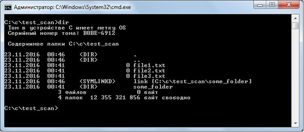

## Чтение файлов в директории

В стандарте си отсутствует реализация работы с папками – ни создания, ни чтения директории, ничего. Для работы с папками в кроссплатформенной библиотеке libuv есть набор методов. Но сначала рассмотрим особенности файловой системы.
Библиотека libuv выделяет следующие типы файлов, описанные с помощью перечисляемого типа uv_dirent_type_t:

Для чтения содержимого папки сначала производим запрос uv_fs_scandir

```
int uv_fs_scandir(uv_loop_t* loop, uv_fs_t* req, const char* path, int flags, uv_fs_cb cb)
```

Все аргументы функции нам уже знакомы. Результатом выполнения (напомню, результат – это поле result запроса, который 
будет передан колбэку) будет число считанных объектов в папке. Для прохода по всем элементам используется функция 
uv_fs_scandir_next

```
int uv_fs_scandir_next(uv_fs_t* req, uv_dirent_t* ent)
```

где req – это полученный колбэком запрос, а второй аргумент – это структура типа uv_dirent_t. Эта структура после каждой
 итерации будет иметь интересующие нас значения – поле name с именем объекта, и поле type типа uv_dirent_type_t, 
 которое определяет тип объекта (о нём говорилось в самом начале).

Для тестирования создадим папку с тремя файлами, папкой и ссылкой.



Код программы для чтения списка файлов в каталоге

```
#include <uv.h>
#include <stdio.h>
#include <fcntl.h>
#ifdef _WIN32
#include <conio.h>
#include <Windows.h>
#define Sleep(x) Sleep(x)
#define wait() _getch()
#else
#include <unistd.h>
#define Sleep(x) sleep(x)
#define wait() scanf("1");
#endif

uv_loop_t* loop;

uv_fs_t scan_req;
uv_fs_t scan_next_req;
uv_fs_t close_req;

void scan_cb(uv_fs_t*);
void close_cb(uv_fs_t*);
const char* name_by_type(uv_dirent_type_t);

const char *dirpath = "C:/c/test_scan";

int main(int argc, char **argv) {
	int r;

	loop = uv_loop_new();

	r = uv_fs_scandir(loop, &scan_req, dirpath, O_RDONLY, scan_cb);
	if (r < 0) {
		printf("Error at opening file: %s\n", uv_strerror(r));
	}

	uv_run(loop, UV_RUN_DEFAULT);
	uv_loop_close(loop);
	return 0;
}

void scan_cb(uv_fs_t *req) {
	int r, i;
	uv_dirent_t dent;

	while (UV__EOF != uv_fs_scandir_next(req, &dent)) {
		printf("%s\t[%s]\n", dent.name, name_by_type(dent.type));
	}
	r = uv_fs_close(loop, &close_req, req->file.fd, close_cb);
	uv_fs_req_cleanup(req);
}

void close_cb(uv_fs_t* req) {
	wait();
}

const char* name_by_type(uv_dirent_type_t type) {
	switch (type) {
	case UV_DIRENT_UNKNOWN:
		return "Unknown";
	case UV_DIRENT_FILE:
		return "File";
	case UV_DIRENT_DIR:
		return "Directory";
	case UV_DIRENT_LINK:
		return "Link";
	case UV_DIRENT_FIFO:
		return "FIFO special file";
	case UV_DIRENT_SOCKET:
		return "Socket";
	case UV_DIRENT_CHAR:
		return "Char file";
	case UV_DIRENT_BLOCK:
		return "Block file";
	}
}
```

Для создания новой директории есть две функции

```
int uv_fs_mkdir(uv_loop_t* loop, uv_fs_t* req, const char* path, int mode, uv_fs_cb cb)
```

создаёт новый каталог. Стоит заметить, что аргумент mode  не используется в ОС Windows. Также можно использовать функцию

```
int uv_fs_mkdtemp(uv_loop_t* loop, uv_fs_t* req, const char* tpl, uv_fs_cb cb)
```

которая создаёт каталог с уникальным именем. При этом аргумент tpl – это шаблон имени, в котором последние 6 символов буду заменены на случайный набор символов.

Пример создания папки. Далее все директивы пропущены, чтобы уменьшить размер программы

```
uv_loop_t* loop;
 
uv_fs_t mkdir_req;
uv_fs_t close_req;
 
void mkdir_cb(uv_fs_t*);
void close_cb(uv_fs_t*);
 
const char *dirpath = "C:/c/test_dir";
 
int main(int argc, char **argv) {
    int r;
 
    loop = uv_loop_new();
 
    r = uv_fs_mkdir(loop, &mkdir_req, dirpath, O_RDONLY, mkdir_cb);
    if (r < 0) {
        printf("Error at making directory: %s\n", uv_strerror(r));
    }
 
    uv_run(loop, UV_RUN_DEFAULT);
    uv_loop_close(loop);
    return 0;
}
 
void mkdir_cb(uv_fs_t* req) {
    int r = req->result;
    uv_fs_close(loop, &close_req, req->file.fd, close_cb);
    uv_fs_req_cleanup(req);
}
 
void close_cb(uv_fs_t* req) {
    printf("wait");
    wait();
}
```

При создании папки с уникальным именем её имя будет в поле path запроса

```
uv_loop_t* loop;
 
uv_fs_t mkdir_req;
uv_fs_t close_req;
 
void mkdir_cb(uv_fs_t*);
void close_cb(uv_fs_t*);
 
const char *template = "C:/c/my-folder-template-XXXXXX";
 
int main(int argc, char **argv) {
    int r;
 
    loop = uv_loop_new();
 
    r = uv_fs_mkdtemp(loop, &mkdir_req, template, mkdir_cb);
    if (r < 0) {
        printf("Error at making directory: %s\n", uv_strerror(r));
    }
 
    uv_run(loop, UV_RUN_DEFAULT);
    uv_loop_close(loop);
    return 0;
}
 
void mkdir_cb(uv_fs_t* req) {
    int r = req->result;
    printf("tmp folder name = %s", req->path);
    uv_fs_close(loop, &close_req, req->file.fd, close_cb);
    uv_fs_req_cleanup(req);
}
 
void close_cb(uv_fs_t* req) {
    wait();
}
```

Для удаления папки в кроссплатформенной библиотеке libuv используется функция

```
int uv_fs_rmdir(uv_loop_t* loop, uv_fs_t* req, const char* path, uv_fs_cb cb)
```

Важно, что директория должна быть пустой.

Пример программы для удаления пустой директории

```
#include <uv.h>
#include <stdio.h>
#include <fcntl.h>
#ifdef _WIN32
#include <conio.h>
#define wait() _getch()
#else
#define wait() scanf("1");
#endif

uv_loop_t* loop;
uv_fs_t remove_dir_req;

void remove_dir_cb(uv_fs_t*);

const char *dirname_remove = "C:/c/toremove";

int main(int argc, char **argv) {
	int r;

	loop = uv_default_loop();
	r = uv_fs_rmdir(loop, &remove_dir_req, dirname_remove, remove_dir_cb);
	if (r) {
		printf("Error when remove directory: %s\n", uv_strerror(r));
	}
	uv_run(loop, UV_RUN_DEFAULT);
	return 0;
}

void remove_dir_cb(uv_fs_t* req) {
	int r = req->result;
	printf("remove callback with status %d", r);
	uv_fs_req_cleanup(&remove_dir_req);
	wait();
}
```

