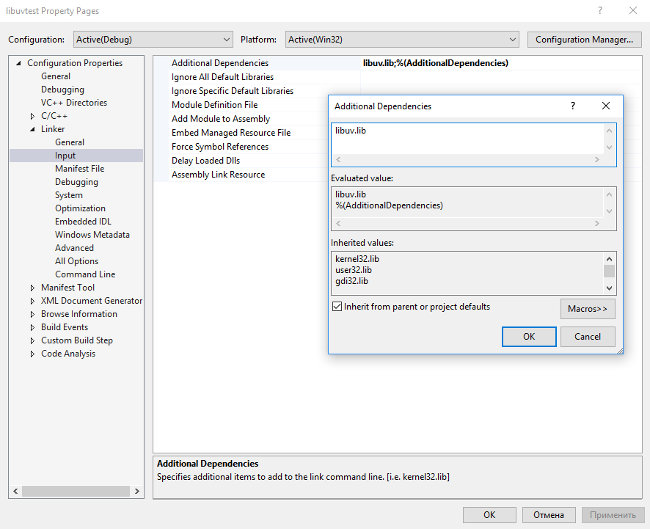

## Установка библиотеки libuv

libuv – кроссплатформенная библиотека на языке си, предоставляющая поддержку асинхронного ввода/вывода, основанная на 
цикле ожидания. Изначально создавалась для Node.js, но позднее стала использоваться и в других проектах.

Для установки на платформе Windows воспользуемся самым простым решением – скачаем готовый 
инсталлятор с сайта libuv. В моём случае последняя версия 1.9.1

Скачиваю libuv-x86-v1.9.1.build10.exe, файл выбираете в зависимости от своей архитектуры. 
Запускаете инсталлятор, который по умолчанию разместит необходимые файлы в папке C:\Program files\libuv.
Далее действуйте, как и в случае установки pthreads.

В папку bin пакета 
Visual Studio скопируйте файл libuv.dll. У меня она располагается по адресу C:\Program Files\Microsoft Visual 
Studio 14.0\VC\bin.

В папку lib пакета VC скопируйте файл libuv.lib. У меня она располагается 
по адресу C:\Program Files\Microsoft Visual Studio 14.0\VC\lib.

Все заголовочные файлы папки include скопируйте в папку include Visual Studio. У меня она располагается по адресу 
C:\Program Files\Microsoft Visual Studio 14.0\VC\include.

Далее, создайте пустой проект. Откройте окно «Свойства проекта». Для этого либо кликните правой кнопкой мыши по имени проекта 
в Обозревателе решений | Свойства, либо откройте Проект | Свойства.
Во вкладке Свойства конфигурации | Компоновщик | Ввод добавьте справа в дополнительные зависимости имя 
библиотеки libuv.lib.



Простая программа

```
#include <stdio.h>
#include <uv.h>

int64_t counter = 0;

void wait_for_a_while(uv_idle_t* handle) {
	counter++;

	if (counter >= 10e6) {
		uv_idle_stop(handle);
	} 
}

int main() {
	uv_idle_t idler;

	uv_idle_init(uv_default_loop(), &idler);
	uv_idle_start(&idler, wait_for_a_while);

	printf("Idling...\n");
	uv_run(uv_default_loop(), UV_RUN_DEFAULT);

	uv_loop_close(uv_default_loop());
	return 0;
}
```

