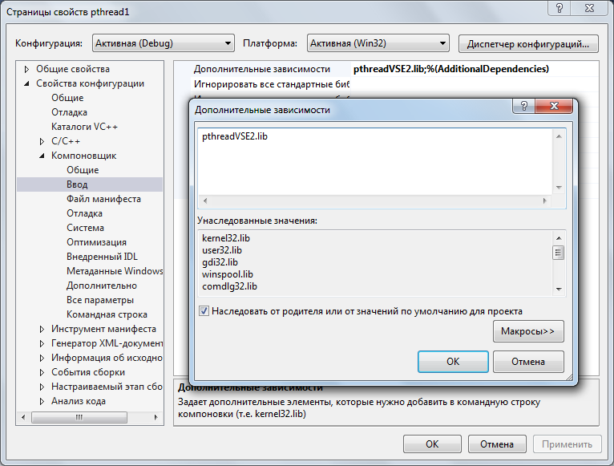

## Установка библиотеки pthread.h в среде Visual Studio

На примере Visual Studio 2012 Express Edition, Windows 7. Воспользуемся ресурсом 
ftp://sourceware.org/pub/pthreads-win32/dll-latest

Теперь появится возможность добавлять библиотеку pthread.h: Visual Studio увидит её, будет подсвечивать синтаксис и выводить подсказки.



Каждый новый проект потребует этого шага. Для проверки напишем простое приложение

```
#include <stdio.h>
#include <stdlib.h>
#include <pthread.h>
#include <conio.h>

#define ERROR_CREATE_THREAD -11
#define ERROR_JOIN_THREAD   -12

void* helloWorld(void *args) {
	printf("Hello from thread!\n");
	return NULL;
}

int main() {
	pthread_t thread;
	int status;
	int status_addr;

	status = pthread_create(&thread, NULL, helloWorld, NULL);
	if (status != 0) {
		printf("main error: can't create thread, status = %d\n", status);
		exit(ERROR_CREATE_THREAD);
	}
	printf("Hello from main!\n");

	status = pthread_join(thread, (void**)&status_addr);
	if (status != 0) {
		printf("main error: can't join thread, status = %d\n", status);
		exit(ERROR_JOIN_THREAD);
	}

	printf("joined with address %d\n", status_addr);
	_getch();
	return 0;
}
```

Вместо pthreadVSE2 можно качать и устанавливать файлы pthreadVC2. Но тогда и в дополнительных зависимостях придётся писать pthreadVC2.lib.

